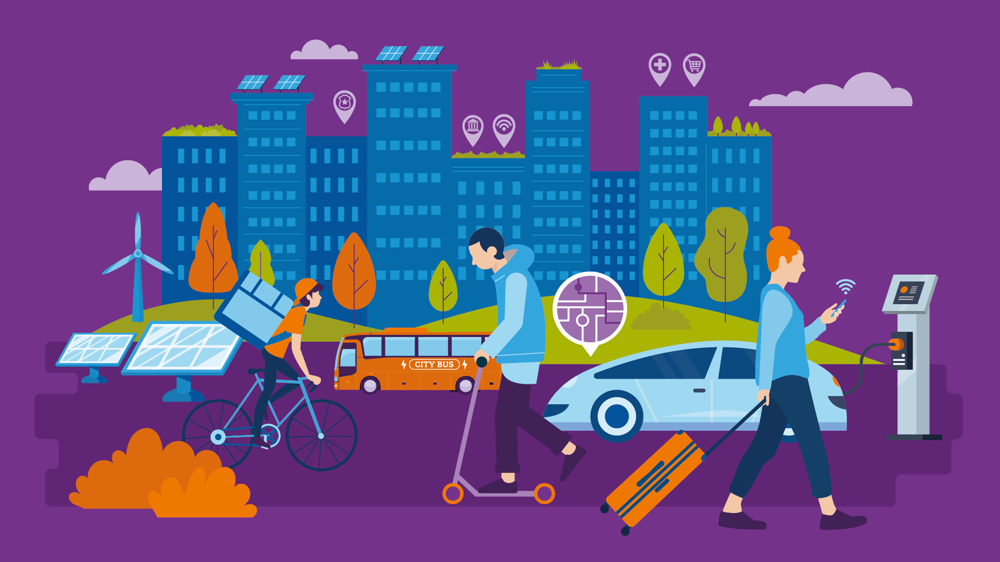

**Industrial IoT** (Internet of Things) är en viktig del i Industri 4.0 - den digitala revolutionen inom industrin. Begreppet syftar till digitalisering och uppkoppling av maskiner för att bland annat kunna förutse och planera underhåll och optimera processer.

Den 6 november klockan 12:15 bjuder Cybercom in till lunchföreläsning för att berätta mer om detta spännande, högaktuella och snabbt växande område.

<!--more-->

På vilket sätt jobbar Cybercoms Center of Excellence med dessa frågor? Vad för utmaningar möter Cybercoms IoT-team, och hur har de tagit sig an dessa utmaningar?

Cybercom bjuder självklart på mat till alla anmälda!

När? Onsdag 6/11 12.15-13.00  
Var? C2  
Anmälan: [https://forms.gle/t2VbTHG4tHTww3pm7](https://forms.gle/t2VbTHG4tHTww3pm7)

Evenemanget på Facebook: [https://www.facebook.com/events/2538952209667915/](https://www.facebook.com/events/2538952209667915/)
