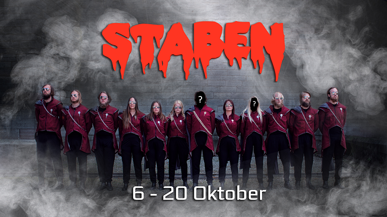

Tiden är kommen! Äntligen har ansökan till General och Kassör för nästa STABEN öppnat!

Vi i Valberedningen söker just nu en General och en Kassör till nästa läsårs STABEN. Så är du taggad på att leda en grupp STABAR genom deras livs äventyr? Eller kanske se till så att ekonomin går runt under tiden? Är du taggad på att ge Nollan ett oförglömligt Nolle-P? Då ska du ta chansen att söka nu!

<!--more-->

### Postbeskrivningar

**Generalen** har som uppgift att leda hela STABEN genom verksamhetsåret och se till så att allt som ska göras genomförs. Förutom att ha ansvar över STABEN så arbetar Generalen även väldigt nära generaler i andra fadderier för att tillsammans kunna genomföra ett så bra Nolle-P som möjligt.

**Kassörens** uppgift är att ha ansvaret över STABENs ekonomi under året. Bokföring är något man blir tokduktig på om man söker Kassör. Förutom att ha koll på ekonomin så är Kassören, genom vått och torrt, även Generalens högra hand.

* * *

Känner du att någon av posterna lockar dig? Då hittar du ansökningsformulär här: [Ansökan](https://forms.gle/fxTw54XCjCXC8iUXA)

Känner du att detta kanske inte alls är något för dig men vet någon annan som hade passat perfekt till någon av posterna. Då går det bra att nominera den personen i länken nedan: [Nominering](https://forms.gle/9HW7RAPQrYzNDs878?fbclid=IwAR365zEaK1BvssyR1rV3jdBh8JBlXd2GTM2Vtx5IZflMk1IU_SKVhIok_BA)

Har du några frågor så var inte rädd för att maila oss på [val@d-sektionen.se](mailto:val@d-sektionen.se) eller skriva till nuvarande General, [general@staben.se](mailto:general@staben.se) eller Kassör, [kassor@staben.se](mailto:kassor@staben.se) för mer postspecifika frågor.

Ansökan är öppen fram till kl 23:59 den 20 oktober och intervjuer kommer ske löpande.
