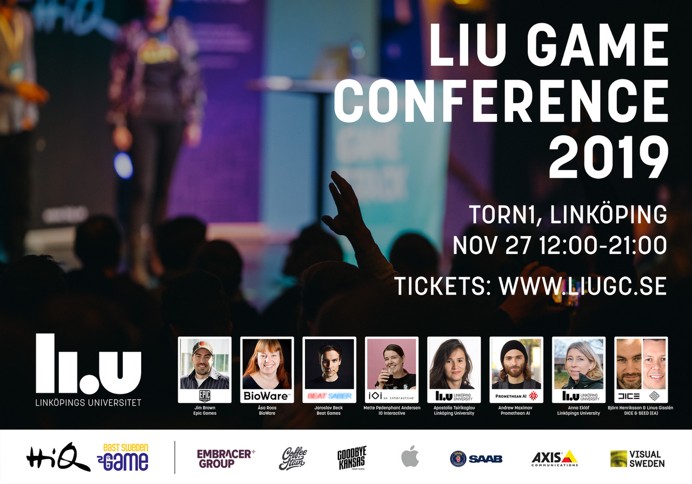

_LiU Game Conference_ är unikt event kring dataspelsutveckling med föreläsare från Epic Games, Electronic Arts, Bioware, Beat Saber och fler - samt forskning inom AI, visualisering och bildanalys, speltävling, party och en helt ny scen i restaurangen. Eventet är gratis och lockar studenter, spelutvecklare, företag och forskare - vi siktar på över 1000 besökare den 27 november, i Linköping!

Mer info och biljetter: [www.liugc.se](http://www.liugc.se/)   
Eventet på Facebook: [www.facebook.com/events/2305071359806324](http://www.facebook.com/events/2305071359806324)

<!--more-->

Några highlights:

- LiU Game Conference firar 10 år!
- Epic Games är ett av världens mest framgångsrika spelföretag som bland annat ligger bakom megasuccén Fortnite. De kommer till Linköping för att prata om värdet av att analysera designprocessen bakom ett spel.
- Beat Saber är världens mest spelade VR-spel. Grundaren kommer till Linköping för att berätta hur de nått sådan enorm framgång.
- Electronic Arts är värdens största spelförläggare med utvecklingskontor i Stockholm. De kommer till Linköping för att berätta hur de använder AI och machine learning för att förbättra sina spel.
- Hitta jobb och exjobb på företagsutställningen!
