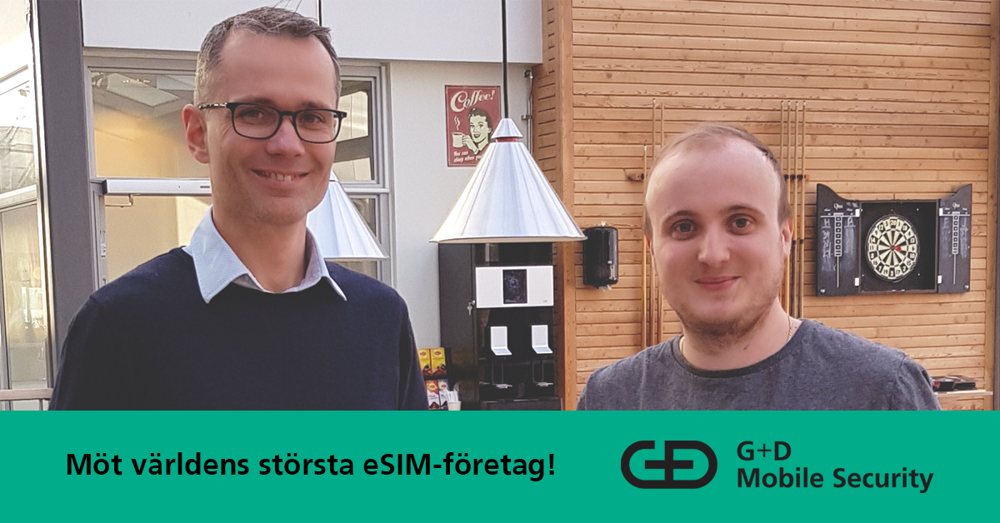

**Möt världens största eSIM-företag!**

Den 12 november bjuder mjukvaruutvecklaren G+D Mobile Security in till en spännande lunchföreläsning på Linköpings Universitet! Du kommer att få höra från Viktor och Mats om deras vardag på R&D avdelningen och hur det är att jobba med systemutveckling inom den exploderande eSIM-marknaden.

<!--more-->

Efter föreläsningen finns det möjlighet att ställa frågor samt delta i speedintervjuer för G+Ds talangprogram till våren och hösten 2020. Talangprogrammet är en unik chans att få inblick i olika teknologier och arbetssätt samt att lära känna företaget och kollegor i olika team. Allt det bidrar att man får rätt förutsättningar att utvecklas som systemutvecklare. Kontakta Daniel Klasson [daniel.klasson@academicwork.se](mailto:daniel.klasson@academicwork.se) för att boka en tid.

När? 12 november 12.15 - 13.00  
Var? C2

G+D bjuder självklart på mat och dryck!

Anmälan: [https://forms.gle/KqWkVYWB3x2FrHwE9](https://forms.gle/KqWkVYWB3x2FrHwE9)

Evenemanget på Facebook: [https://www.facebook.com/events/471444390129439/](https://www.facebook.com/events/471444390129439/?acontext=%7B%22source%22%3A108%2C%22action_history%22%3A%22%5B%7B%5C%22surface%5C%22%3A%5C%22post_page%5C%22%2C%5C%22mechanism%5C%22%3A%5C%22surface%5C%22%2C%5C%22extra_data%5C%22%3A%5B%5D%7D%5D%22%2C%22has_source%22%3Atrue%7D&source=108&action_history=%5B%7B%22surface%22%3A%22post_page%22%2C%22mechanism%22%3A%22surface%22%2C%22extra_data%22%3A%5B%5D%7D%5D&has_source=1&__tn__=K-R&eid=ARCZyqJ4CFFr6Gy0bo0G9aK2TSG8Bfnt2KAxv-EN2Y86b-CGqVkgO-_z7kWRaIdfoKXO9xIGEqnt2Jy7&fref=mentions&__xts__%5B0%5D=68.ARDo1Z98_68tiq2TXwUmIuoi_jQenHKT_cl83rXeSBAxSC7ZM3M0fzEpNNukejuZeCFaEEEseo69XGBSooVpl3HQAPDz6G74k21LIVq_83z57IqFUYWqxmLn5CtGflmiktCf95T2bO7Zt522FwCYXDEumafecod4WF8hAi_Ys3J1S38Aqf19lwbTDK0zNI1y7WFI36bhBNHBcZYEmYmHDYA0z79zA7NAxcRjEaU_TA7sjR8lWjU333MLrZ0xxhVeQCtJ25QpdQ6-nJHphx8PDsfgl7yHTfUNPKfST0GH6ZaM4jM2WnEa46A1-I_Z_oqFbQdx)
