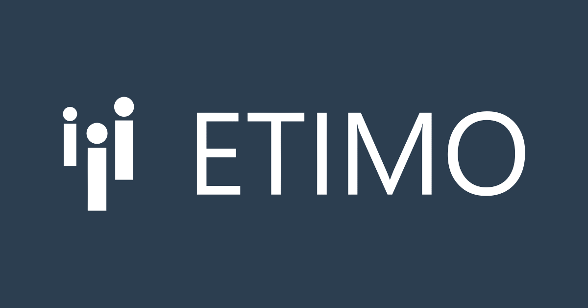

**Vi bygger Sveriges ledande utvecklingsorganisation**

Delar du vår passion för att utveckla moderna digitala lösningar, teknik i framkant och vilja att göra samhällsnytta? Vill du skapa kundvärde och användarnytta? Då vill vi höra från dig! Vi söker löpande efter både exjobbare och nya kollegor på heltid. Maila din ansökan via [https://etimo.se/karriar/](https://etimo.se/karriar/).

<!--more-->

**Som konsult på Etimo**

- Väljer du själv dina uppdrag
- Lägger du 10% av din arbetstid på kompetensutveckling
- Tydlig karriärväg, platt hierarki och total transparens
- Personlig mentor
- Har du riktigt duktiga kollegor
- En koddag / månad då vi tillsammans jobbar med våra Open Source projekt
- Jobbar du både inhouse och ute hos kund
- Fredagar jobbar vi från kontoret (ofta kombinerat med AW och/eller VR-spelande:)
- Möjlighet till delägarskap (bolaget ägs till 100% av seniora medarbetare)

**Om oss**

Etimo är ett växande IT-konsultbolag som utvecklar affärskritiska digitala tjänster inom bl.a. finans, media, e-hälsa och utbildning. Etimo fokuserar på ny- och vidareutveckling med tekniker som .NET, azure, java, docker, AWS, angular, react, node och python.

Vi värdesätter teknisk kompetens, affärsförståelse, kommunikations- och samarbetsförmåga och en vilja att ständigt utvecklas. Vi sitter i trevliga lokaler på Kungsgatan 55 och har en av Stockholms bästa VR-studios på kontoret där vi brukar kombinera VR-spelande med AW.
