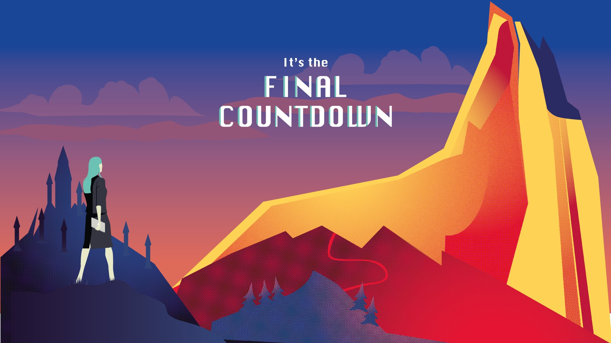

Rumor has it that beyond the horizon of Östgötaslätten, a different kind of life exists. A life without exams, a life without microwave queues, a life outside LiU. We have all heard about it, but can this really be true? 

Netlight welcomes final year students to an evening where we get a taste of what such a life could be like. The evening will serve opportunities, insights and free food. What does it really mean to work as a consultant? How do we step from our student world into working life and what can Netlight help you with? We want to pep and help you take the step from studies at the university to working in the industry. 

<!--more-->

Where? Zodiaken @ Campus Valla Linköping University  
When? 10 of December, 17.15 - approx. 21.30

Read more: [https://www.facebook.com/events/578710396273222/](https://www.facebook.com/events/578710396273222/)

Sign up: [https://liu-final-countdown.confetti.events/](https://liu-final-countdown.confetti.events/)
