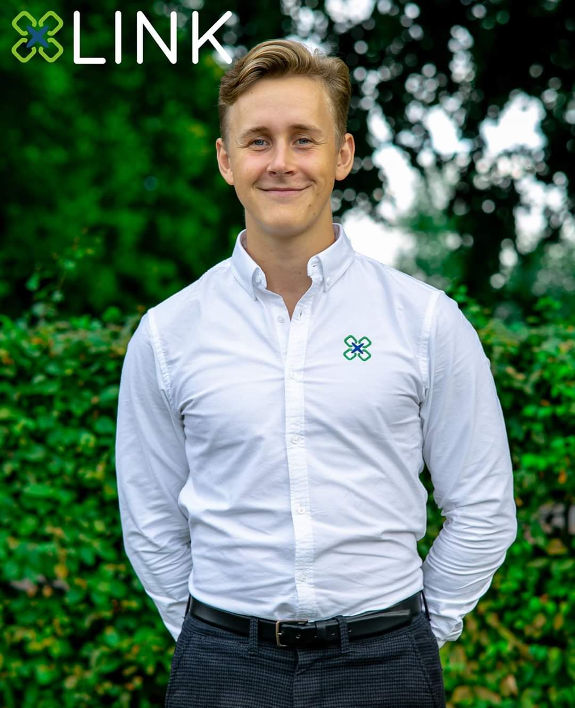

Infoutskottet är ute på intervjuturné i en serie reportage vi har valt kalla för **Sektionsaktiv i fokus**! Första stoppet är hos LINK! Vi har här bett om att få intervjua en person som inte är ordförande eller förtroendevald! De slängde fram en av dess finaste representanter!

Vi önskar er god läsning!

## Vem är du? (Namn? Vilket år? Program?) 

Hugo Cedervall heter jag och pluggar 3:e året på mjukvaruteknik!

## Vad är din post i LINK?

Jag är webbansvarig i LINK, så jag är med i IT-gruppen.

<!--more-->

## Vad innebär din post? (Uppgifter etc.)

Egentligen så är väl alla i IT-gruppen webbansvariga men vi har väl lite interna roller. Men i det stora hela så har vi byggt om hela hemsidan från grunden och utvecklat system som går att använda för resterande i LINK. Funktioner som gör det enkelt för resterande kommitté att lägga in event, företag och liknande, som folk kan anmäla sig till och så vidare!

## Vad är din största styrka i LINK?

Jag skulle säga att jag är ganska envis, så jag kan sitta med ett litet problem väldigt länge och släpper det inte förens det blir väldigt bra! Gillar att jobba med de små detaljerna!

## Kan du med egna ord förklara vad LINK gör?

Vi ger studenter möjlighet att binda kontakter med företag genom ett antal olika event, och sen såklart på mässdagen. Så det är två veckor fullspäckade av möten mellan studenter och företag som vi jobbar för. 

Om man går in på vad vi gör internt i LINK så har vi delat upp det i olika ansvarsområden bestående av event-, mäss-, marknadsförings-, företags- och IT-gruppen. Hoppas jag inte glömmer någon haha, men jag tror det är dem. Så alla grupper har sina egna ansvarsområden dem sköter, men vi har en del tillsammans där alla får vara med och tycka till och hjälpas åt. Som till exempel nu de senaste två veckorna så har det varit mycket gemensamt i samband med vår PR-period och en drös av event!

## Hur är umgänget i LINK?

Det är riktigt bra! Folk är härliga, glada och taggade som bara den! Det är kul och känns nice att vi har haft ett så stort mål att jobba emot under året som äntligen börjar närma sig. Dessa två intensiva veckor nu har bidragit mycket till gemenskapen och sammanhållningen.

## Vad är det absolut bästa med LINK?

Just för mig har det bästa varit att lära mig massa nya grejer och jobba i ett stort projekt! Just i IT-gruppen har det varit väldigt kul att lära mig massa webbrelaterade grejer som jag var väldigt taggad på sen innan!

För studenter så är det perfekt med en nischad IT-mässa. Det blir enklare för intresserade studenter att föreställa sig vad man kan väntas i arbetslivet.  

Sen har det varit väldigt härligt folk att hänga med, ett gott umgänge och roligt har vi haft. Väldigt kul nu också när allt kommer samman och allt jobb ger resultat!

## Om LINK vore en person, hur skulle denna vara?

En glad och positiv IT-nörd!

## Vilket är det bästa utskottet? (Om du inte får välja LINK)

Jag har själv inte varit engagerad i något annat utskott men annars är det Infoutskottet utan tvekan, nu när de gör såhär fina intervjuer! Har aldrig sett något till dess like!

## Vilket annat utskott hade du helst paktat med i en strid med de andra utskotten och varför?

Jag tänker mig en fysisk strid så inte PubU, de hade mest vinglat runt! Men däremot känns Werk ganska bastanta och skulle sitta bra i en strid!

## Vilket utskott hade du helst paktat emot i denna strid och varför?

Det hade varit lite kul att möta WebbU för att se vilka som är mest atletiska mellan oss IT-grupper!

## Fyra snabba:

### Keps eller solhatt?

Keps

### Konsol eller PC?

PC

### Favoritgodis? Varför?

Chips! Godis är ingen höjdare i jämförelse!

### Vad vill du hälsa resten av alla D:are där ute?

TAGGA LINK!
