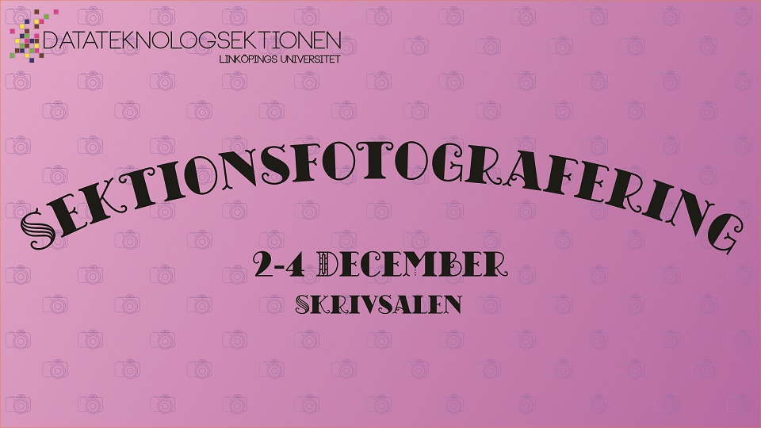

Nu börjar det dra ihop sig till den årliga sektionsfotograferingen. Den kommer i år ske i Skrivsalen på Kårallen (garderoben under kravallerna) under datumen 2/12 - 4/12.

Schemat för sektionsfotograferingen har i bästa möjliga mån tagits fram i syfte att se till att föreläsningar undviks. Detta schema går att hitta en bit längre ner. I år har vi dock sett till att det finns större möjligheter att byta tid om den inte skulle passa. Dock ser vi helst att tiderna byts mellan grupper i första mån. Oavsett tiden så är det viktigt att ni kommer i tid till ert foto.

<!--more-->

Varje år erbjuder vi alla utskott och klasser ett ”vanligt” foto och ett spexfoto där varje grupp själva får komma på något roligt, antingen något som har med utskottet att göra eller något helt utflippat, ni väljer själva.

Vi kommer erbjuda ett finfint pris till den klass respektive det utskott/förening med det bästa spexfotot, så samla ihop ett gäng som har möjlighet att vara med och kom på någonting kul.

Vill ni nu ha någon inspiration eller kanske bara ta en titt på hur tidigare år sett ut? surfa in på sektionens [fotoalbum](http://d-sektionen.se/filarkiv/fotoalbum) och ta en titt!

Är det så att något inte stämmer? har ni frågor? Passar inte er tid? Något annat ni funderar över? Har ni frågor över vad som gäller? Skicka iväg ett mail med era frågor till [foto@d-sektionen.se](mailto:foto@d-sektionen.se).

## Schema

(Alla tider är satta till 15 minuter)

### Klasser

#### 2/12

IT4+ - 11.00  
D4+ - 11.15  
U4+ - 11.30  
U1.b - 11.45  
D1.a - 12.30  
D1.b - 12.45  
D2.a - 13:45  
IT3 - 14:30  
IP1 - 14.45  
U3 - 16.45

#### 3/12

D2.b - 12.30  
IP3 - 12.45  
D1.c - 15:15  
IT2 - 16.15  
U2.b - 16.30

#### 4/12

U2.a - 11:15  
D3.a - 11:30  
D3.b - 11:45  
IP2 - 12.00  
D2.c - 12.15  
IT1 - 12.45  
U1.a - 13.00

* * *

### Utskott/Föreningar

#### 2/12

Donna - 12.00  
Tjejer - 12:15  
LINK - 13.00  
MafU - 14.00  
NärU - 14.15  
PubU - 15.00

#### 3/12

Webbgruppen - 13.00  
UtbU - 14.00  
Valberedningen - 14.15  
InfU - 14.30  
D-LAN - 14.45  
D-Band - 15.00  
Werk - 15.30  
Styret - 15.45  
Kansliet - 16.00  
SexIT - 16.45

#### 4/12

Acats - 10.30  
AktU - 10.45  
Alumni - 11.00  
STABEN - 12.30  
D-Group - 14.00  
Ekonomigruppen (DEG) - 14:15  
STABEN^n - 14.30

* * *

(Notera att schemat kan komma att justeras)

Kom igen, det blir kul!  
Infoutskottet 19/20
