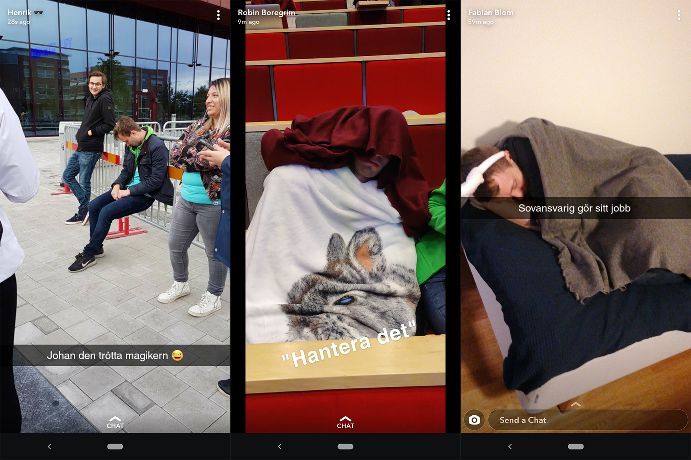

Det är med tårarna i halsen som vi säger att detta är näst sista inlägget i vår intervjuserie! Skönt kanske ingen tänker och det förstår vi! 

Ikväll är det dags för aktivitetshanteraren att berätta lite mer om sin post! Sök denna post eller andra som ska tillsättas under vintermötet [här](https://d-sektionen.se/sok-fortroendeposter-vintermotet-2020/), vet ja!

* * *

## Vem är du?

Johan heter jag och är på mitt fjärde år på Mjukvaruteknik! Jag älskar bra umgänge, och att göra roliga saker med andra. På så sätt har Aktivitetsutskottet alltid passat mig perfekt, vilket är varför jag nu spenderar mitt fjärde år i utskottet (oops)! Jag gillar många olika saker, men allra mest tycker jag om kreativt arbete såsom att spela piano, redigera film/bilder, eller att skriva.

<!--more-->

## Berätta mer om posten som aktivitetshanterare

Posten som aktivitetshanterare så som den är idag är väldigt ny, så det kanske inte är helt uppenbart vad rollen innebär. För min del har jag sett rollen som att vara ett stöd för alla delar av utskottet. Det gäller både undergrupperna, D-LAN samt den gröna AktU-gruppen (som man till båda ska välja gruppledare), D-Band eller helt nya grupper som uppstår. Man försöker se till att vara tillgänglig, hjälpsam, och att ha bra koll på hur arbetet i utskottet som helhet går. Detta eftersom man i mångt och mycket representerar utskottet gentemot de andra utskotten och sektionen i stort.

Konkret deltar man mycket i de olika gruppernas möten, hjälper till med planering samt kontakt med andra utskott och styrelsen genom att gå på till exempel kanslimöten. Under året kommer det förhoppningsvis också dyka upp idéer från sektionsmedlemmar på nya aktiviteter och grupper, så man sitter ofta med ett vakande öga på sin mail och ger det stöd man kan till de som vill anordna något. Man har mycket kontakt med utskottets kassör, då många av frågorna aktivitetshanteraren hanterar handlar om pengar.

## Vad är roligast med att vara aktivitetshanterare?

Det roligaste är alla människor man får träffa, oavsett om det är inom kansliet, utskottets undergrupper eller andra grupper som man hjälper (såsom gruppen som anordnar tackfest, [kan bli kul](https://www.facebook.com/events/1144720082585614/))! Hur mycket man kan och bör engagera sig i undergruppernas arbete beror mycket på vad du och de gruppledare du väljer ut vill göra, så det är viktigt att se till att ha bra kontakt med gruppledarna och bestämmer ett upplägg så att arbetet blir så bra och så roligt som möjligt för alla.

Utöver ansvaret för undergrupperna är en stor del av aktivitetshanterarens arbete att ta emot och stödja helt nya idéer. Det är alltid kul när man får in en ny idé; ofta är det någonting som aldrig gjorts förut på sektionen och som man ofta aldrig ens själv tänkt på skulle vara intressant.

## Bör man ha några erfarenheter för att söka aktivitetshanterare?

Jag tycker inte man behöver ha några speciella erfarenheter för att söka eller bli aktivitetshanterare, det viktigaste är att man är peppad på att hjälpa våra medlemmar anordna aktiviteter! Man har alltid sista ordet när det gäller vilka aktiviteter som anordnas och på vilket sätt, så det bästa är att gå in med ett öppet sinne, men med förmågan att ta tuffa beslut om man måste. Att kunna ha många bollar i luften samtidigt är superbra, då Aktivitetsutskottet gör en massa olika saker hela tiden som det gäller att ha koll på.

## Vem ska söka aktivitetshanterare?

Alla som gillar aktiviteter och är intresserad av att hjälpa andra att få sina idéer genomförda. Arbetet är väldigt flexibelt, och arbetsbördan kan variera, så om det är något som du är ok med så kommer du nog trivas bra. Sen får man vara beredd på att posten som den är just nu fortfarande är ny, och att det inte finns jättemycket facit på hur arbetet som aktivitetshanterare ska funka. Men så länge man känner sig bekväm med det samt möjligheten att forma posten så finns förutsättningarna för ett jättebra år!

## Vilken aktivitetshanterare gillar du bäst av alternativen FIFO eller LIFO?

Svårhanterad fråga. Generellt tycker jag båda alternativen är sådär; jag tycker man borde hantera saker med en lite mer dynamisk prioritering. Vissa saker eller idéer är mer brådskande att hantera än andra. Men om jag måste välja något så är det väl FIFO. Kör man på LIFO, som en stack, så finns ju risken att om, säg, stackars Kalle skickar in en idé till en kaviarätartävling i början av året så får han aldrig något svar om mycket annat dyker upp löpande som då får hanteras först. En kö gör att alla idéer garanterat kommer hanteras någon gång, och även Kalle skulle få svar relativt fort. Men som sagt finns det ju saker som kräver snabbare hantering än andra (kanske inte kaviarätartävling då, sorry Kalle).

## Något mer du vill tillägga?

Mitt favoritgodis när jag var liten var Bassett's Winegums, och jag vet att det här är ett par år sent, men jag tycker personligen att godiset har blivit mycket sämre sedan de bytte recept. Jag skulle därför definitivt stödja en "storma Bassett's-kontoret"-aktivitet; de kan inte stoppa oss alla.

Maila mig på [aktivitetshanterare@d-sektionen.se](mailto:aktivitetshanterare@d-sektionen.se) om du är intresserad, eller om du har andra idéer eller funderingar.
