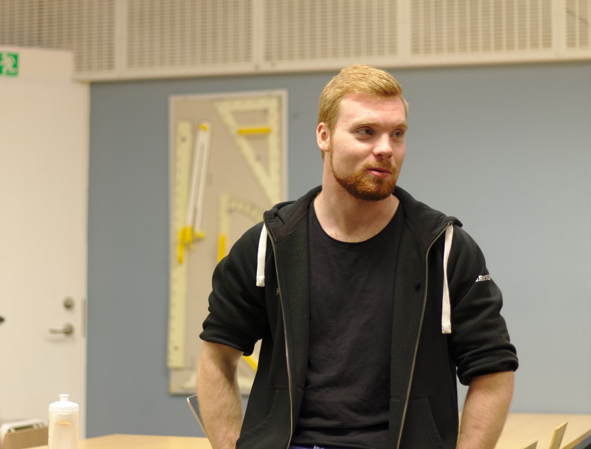

Hela 13 poster senare är vi inne på sista posten för denna intervjuserie och sista intervjun är inte med någon mindre än Aktivitetsutskottets kassör! Posten, liksom samtliga poster som ska tillsättas på vintermötet, söker ni [här](https://d-sektionen.se/sok-fortroendeposter-vintermotet-2020/). 

Vi från InfU önskar i och med detta god läsning, God Jul och gott nytt år!

## Vem är du? (Namn, program, intressen, etc.)

Mitt namn är Hampus Tönnies och jag pluggar 2:a året på mjukvaruteknik. Kommer ursprungligen från de djupa skogarna i Småland där en liten by Myresjö finns. Mina största intressen är såklart allt som har med datorer att göra, men på fritiden spenderar jag gärna min tid på att träna eller ha det roligt med vänner. På campus hittar man mig säkrast i Nettan, Studenthuset eller djupt inne B-Huset!

<!--more-->

## Berätta mer om posten som Aktivitetskassör.

Posten som Aktivitetskassör innebär att du får engagera dig i massa olika aktiviteter som utskottet håller i eller stödjer. Du kommer att ta hand om ekonomin för både Aktivitetsgruppen och D-LAN, vilket innebär att du kommer få vara en del i båda dessa gruppers arbete under året. Posten innebär att du kommer att få budgetera, fakturera och även bokföra utskottets ekonomi. Du kommer att få arbeta med många olika personer och delta på en hel del lunchmöten varje vecka.

## Vad är roligast med att vara Aktivitetskassör?

Det roligaste är att få lära känna det underbara gänget som man främst jobbar med i Aktivitetsgruppen. Otroligt härligt gäng att få arbeta och spendera tid tillsammans med! Sedan så kommer du att få arbeta tillsammans med massa olika personer både inom och utanför sektionen och lära känna massa nya människor på så sätt!

## Bör man ha några erfarenheter för att söka Aktivitetskassör?

För att söka Aktivitetskassör krävs inga tidigare erfarenheter inom ekonomi, du kommer att få lära dig allt som har med kassörsrollen att göra. Jag personligen hade inga större erfarenheter inom ekonomi, men lärde mig det under årets gång. Bra för att söka rollen är om du är strukturerad och gillar Excel.

## Vem ska söka Aktivitetskassör?

Du som har intresse för Ekonomi och gärna vill lära dig mer inom det. Sedan även att du har intresse för att vara med och anordna en stor varietet av aktiviteter för sektionens medlemmar.

## Vilken är din favoritlåt med TimbAktU?

Väldigt bra fråga tycker jag, måste ändå säga "Det löser sig" är min favoritlåt från han. Som student passar det citatet också väldigt bra.

## Något mer att tillägga?

Sök Aktivitetskassör så kommer du ha ett riktigt roligt och Aktivt år framför dig!
