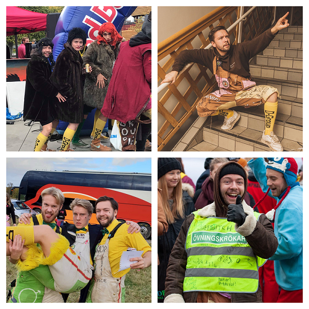

Dagens kvällsintervju är med ingen annan än Chiefen med stort C, festeriets överhuvud! Går du, liksom honom och tänker på DÖMD 24/7 eller taggar du nästa helgens fester redan innan pågående fest har tagit slut! Då låter det som att du behöver söka till posten som festeriets ordförande! Det kan du göra [här](https://d-sektionen.se/sok-fortroendeposter-vintermotet-2020/)!

* * *

## Vem är du? (Namn, program, intressen, etc)

Jag heter Daniel, är 23 år och pluggar mitt andra år på D. Utöver mitt just nu huvudsakliga intresse som är att planera det fetaste DÖMD någonsin så gillar jag att lära mig nya saker, vilket betyder att man ofta finner mig med en bok i handen eller tillagandes av något nytt recept i köket, i övrigt gillar jag att träna och att utmana mig själv med diverse fysiska utmaningar (det har blivit lite mindre av allt detta på senare tid, undrar varför…).

<!--more-->

## Berätta mer om posten som Chief i D-Group.

Som Chief är du ansvarig för att förmedla information till och från gruppen eftersom det oftast är du som är på olika möten där information förmedlas, detta är främst möten med andra kårhus, festerier och studentkårer.  
Du är även den som är ytterst ansvarig till att festeriets arbete går framåt, att det blir gjort bra och att var och en spenderar en rimlig tid på festeriets åtaganden. Formulerat i andra ord: du ansvarar för att arbetet blir gjort och att samtliga medlemmar i gruppen ska må bra.

## Vad är roligast med att vara D-Groups Chief?

Den sociala aspekten. Dels de nya människorna man får lära känna från andra sektioner och fakulteter som är hur härliga som helst men framförallt det D-Group man själv är med och skapar och blir bästa vänner med!

## Bör man ha några erfarenheter för att söka Chief i D-Group?

Jag hade själv inga erfarenheter inom ledarskap i någon form av utskott eller organisation, så nej det skulle jag inte säga, dock är det fördelaktigt att ha det förstås. Fördelaktiga egenskaper att ha som Chief skulle jag säga är driv, empati och tålamod.

## Vem ska söka posten?

Chief ska du söka om du känner att du har (eller kan utveckla) någon av ovanstående egenskaper och är sjukt taggad på att skaffa 12 otroligt bra vänner som du kommer göra storslagna evenemang med (40-års-DÖMD, ju!).

## Hur taggad bör man vara på DÖMD för att bli Chief?

DagligenÖverMotiverad(&)Dö-taggad
