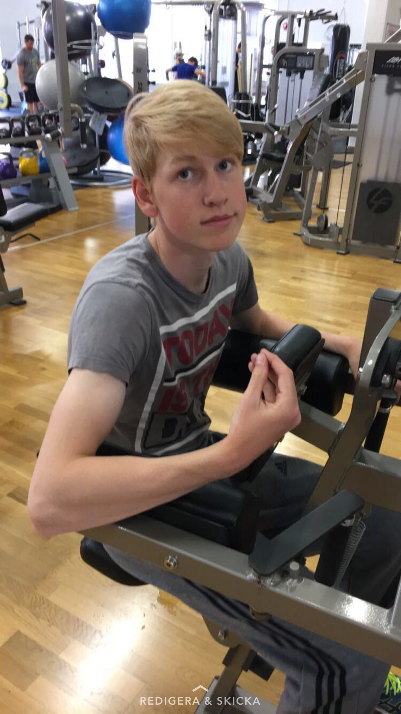

Massa intervjuer blir det när det finns massa poster att söka! Hoppas förresten att ni inte missar det kuliga vintermötet den 3:e februari, det är då man får se hur det går till när personer väljs ut till alla dessa kuliga poster!

På tur att få presentera sin post är D-groups kassör! Kassörsposten kan ni söka [här](https://d-sektionen.se/sok-fortroendeposter-vintermotet-2020/)! I denna intervju har vi fått ett flytande svar på följande frågor:

- Vem är du? (Namn, program, intressen, etc.)
- Berätta mer om posten som festeriets kassör.
- Vad är roligast med att vara festeriets kassör?
- Bör man ha några erfarenheter för att söka festeriets kassör?
- Vem ska söka festeriets kassör?
- Vad är bra att tänka på innan man släpar sin lurviga till DömD?
- Något mer att tillägga?

* * *

Hejsan! 

Jag heter Mattias Johansson och är kassör eller som vi kallar det Ca$h för D-Group.

Går för övrigt i D2 där jag går och dagdrömmer om DÖMD. Har spelat mycket golf i mina dar men spelar inte alls så mycket som jag vill just nu.

<!--more-->

Min post i D-Group går kort och gott ut på att ha koll på ekonomin.Det är budgetar som ska läggas och transaktioner som ska bokföras.

Det roligaste med min post är att vara den med sista ordet kring ekonomin. Det gör att man känner att man bidrar på ett konkret sätt till gruppens framgång.

När det kommer till erfarenheter tycker jag att det är viktigare att man har vissa personlighetsdrag än gudalika budget skills. Vill man så kan man lära sig om sånt. Därför tycker jag att du ska söka min post om du känner att du vill jobba hårt tillsammans med en grupp under ett tufft men också så givande år.

Din grupp och du kommer skapa många fantastiska saker, inte minst DÖMD.

Hoppas ni ser fram emot DÖMD lika mycket som jag så syns vi där. XOXO Slim Shady
