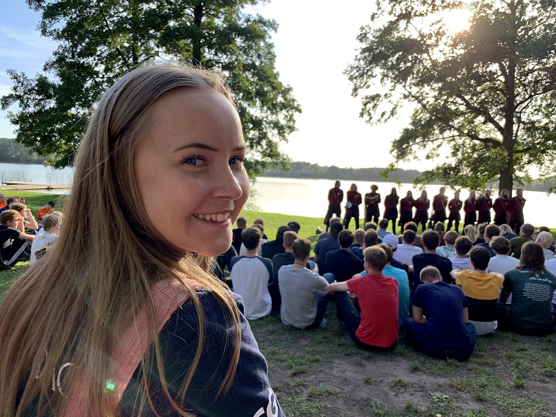

Ännu en intervju och vi har inte lämnat Donna än, utan vi måste först se till att Donnas kassör får säga sitt om posten! Sök posten [här](https://d-sektionen.se/sok-fortroendeposter-vintermotet-2020/) fort eller i annan föredragen hastighet!

* * *

## Vem är du? (Namn, program, intressen, etc.)

Jag heter Rebecca är 23 år gammal och pluggar andra året på IT. Jag försöker träna lite då och då men annars umgås jag med familj och vänner eller kollar på någon serie!

<!--more-->

## Berätta mer om posten som Donnas kassör.

Det är en väldigt lärorik post där man får chansen att göra något man kanske aldrig skulle ha gjort annars. Posten handlar främst  om att sätta och följa budgetar samt bokföra, men även att sköta fakturor och utlägg osv. Helt enkelt ha det ekonomiska ansvaret för Donna och se till så att allt går ihop rent ekonomiskt.

## Vad är roligast med att vara kassör i Donna?

Jag själv tycker det roligaste har varit att ha nära kontakt med alla andra i Donna i och med att allt ska fungera med budget och liknande, men även den kontakt jag haft med kassörer i de andra damföreningarna! Det har även varit roligt att planera och budgetera för de olika eventen. Som kassör i Donna är man dessutom med i kansliet och får därmed vara med och se vad som händer i sektionen i stort.

## Bör man ha några tidigare erfarenheter?

Absolut inget måste. Jag hade själv inga tidigare erfarenheter av att vara kassör och tycker det har fungerat bra ändå. Det viktigaste är att vilja lära sig och inte vara rädd för att fråga om det är något man undrar över.

## Vem ska söka posten?

Alla kan söka! Som tidigare nämnt så krävs inga tidigare erfarenheter, bra egenskaper att ha är kanske dock att man är relativt noggrann och strukturerad då det är en del saker att hålla koll på.

## Vilken är din favoritlåt med MaDonna?

Som kassör är det såklart Material Girl, pengar är livet <3

## Något mer att tillägga?

Söök det blir kul!
