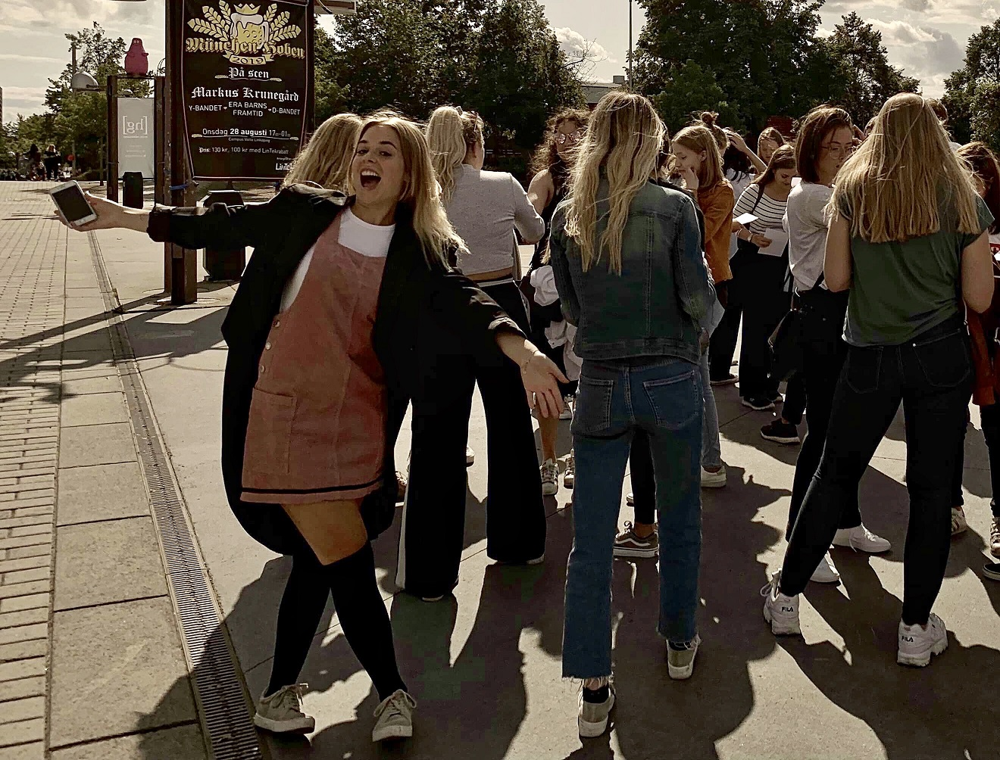

Vi hoppar nu över till ett annat utskott och fäller ut landstället hos D-sektionens damförening Donna! Posten som Donnas ordförande, samt övriga poster som ska tillsättas under vintermötet den 3:e februari, söks [här](https://d-sektionen.se/sok-fortroendeposter-vintermotet-2020/)!

* * *

## Vem är du? (Namn, program, intressen, etc.)

Mitt namn är Clara och jag pluggar just nu andra året på IP. Förutom att planera och arrangera event  tillsammans med de andra i Donnastyret så är musik ett stort intresse för mig. Vanligtvis sjunger jag mestadels i duschen, men kanske har ni sett mig med D-Band på Kårallen någon gång. 

<!--more-->

## Berätta mer om posten som Donnas ordförande.

Som PrimaDonna har jag ansvar för att välja ut resterande Donnastyret tillsammans med Kassören, lägga upp en plan för året och sedan se till att den planen följs. Förutom det så är det som ordförande viktigt att känna av med gruppen hur alla mår, ha ett helhetsintryck över hur allas uppgifter flyter på, men även att vara kontakten utåt på sektionsmöten, kanslimöten och möten med de andra damföreningarnas ordföranden. 

## Vad är roligast med att vara ordförande i Donna?

Det absolut roligaste tycker jag är att få chansen att lära känna så många nya människor, både inom och utanför sektionen som jag inte kände innan. Det är också sjukt kul att arrangera alla Donnaevent under året, och att göra det tillsammans med ett så härligt gäng som tjejerna i Donnastyret!!!

## Bör man ha några tidigare erfarenheter?

Jag tycker inte alls att man behöver några speciella erfarenheter sedan innan. Visst underlättar det om man haft en ledarroll tidigare, men har man inte det så är det ingen anledning att tveka! Det viktigaste är att man kan ta för sig i en grupp, är öppen för uppgiften och tar den på allvar tycker jag.

## Vem ska söka posten?

Jag tycker att alla som funderat på att söka Donna någon gång borde söka nu! Det är enormt lärorikt och något som man borde passa på att ta chansen att få göra. Är du strukturerad, driven, öppen för förändring och har nya idéer för Donna, eller bara är sjukt jäkla taggad så låter det som att du skulle passa perfekt för nästa års PrimaDonna!!! 

## Finsittning eller fulsittning? (Motivera)

Den var svår! Men måste nog ändå svara finsittning eftersom vi i Donna arrangerar flera stycken och för att det är roligt att klä upp sig :) 

## Något mer att tillägga?

Det ska bli så kul att få veta vem som blir min bäbis! Tveka inte att stalka upp mig på Facebook om du har några frågor eller vill att jag berättar mer!
