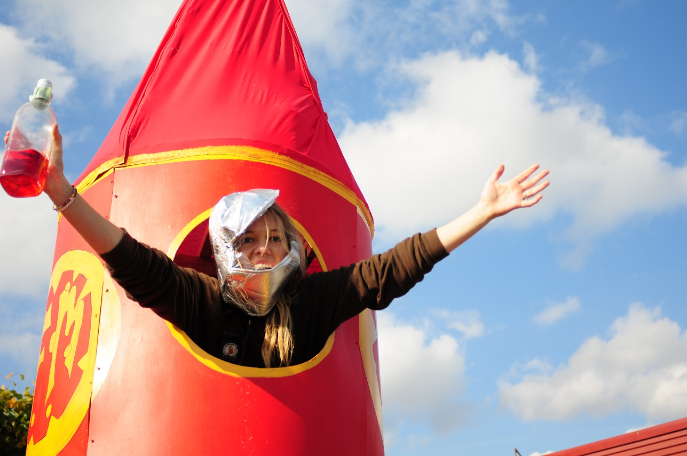

Idag, den 16 december 2019, 17 veckor och 6 dagar innan påskafton, så har rekryteringsperioden startat för en massa roliga poster inom D-sektionen! Du kan finna dem alla [här](https://d-sektionen.se/sok-fortroendeposter-vintermotet-2020/).

Som inspiration har Infoutskottet skickat iväg massa nyttiga frågor till personer som just nu sitter på posterna. Detta för att förhoppningsvis locka just dig till någon av posterna!

Först ut är vår alldeles egna sektionsordförande Madeleine Bäckström, om ni är intresserad av att söka posten som sektionsordförande kan ni göra det om ni följer länken [här](https://d-sektionen.se/sok-fortroendeposter-vintermotet-2020/)!

* * *

## Vem är du? (Namn, program, intressen, etc.)

Jag är Madeleine Bäckström, eller ja, Maddis Bäckström! Jag kommer ursprungligen från Falun och jag går fjärde året på IT-programmet. Jag har tidigare bland annat varit med i D-Group och varit basgruppshandledare. På fritiden gillar jag att hänga med vänner, kasta plast i skogen (discgolf) och dricka en härlig öl lite då och då med kompisarna.

<!--more-->

## Berätta mer om posten som sektionsordförande.

Här kommer en kortfattad beskrivning! Som sektionsordförande har du, tillsammans med din styrelsekollega kassören, det yttersta ansvaret för sektionen. Du är kontaktperson för externa parter, diskuterar och skriver avtal, leder styrelsen och ser till att allting flyter på som det ska. Sen är det ju sektionsordförande som är mötesordförande under alla sektionsmöten.

## Vad är roligast med att vara sektionsordförande?

Jag har hittills under mitt verksamhetsår fått lära mig mer om hur hela sektionen fungerar i sin helhet, vilket är både lärorikt och roligt. Om jag tänker mer postspecifikt skulle jag säga att det är roligt att utmana sig själv i att sammanföra en grupps arbete samt hålla en hel del bollar i luften. Slutligen så måste jag säga att det är riktigt roligt att vara mötesordförande under sektionsmöten! Lite läskigt så klart, men mer roligt än läskigt!

## Bör man ha några erfarenheter för att söka sektionsordförande?

Tidigare engagemang på sektionen tror jag kan vara väldigt skönt att ha i bagaget. Att ha en hyfsad uppfattning om hur sektionen är uppbyggd och hur den fungerar generellt skulle jag säga är väldigt bra att ha och det upplever jag att jag fick tack vare tidigare engagemang inom andra utskott. Sedan skulle jag säga att om du har ledarerfarenheter kan det också vara en fördel.

## Vem ska söka sektionsordförande?

En person som värnar om sektionens utveckling, är taggad på att strategiskt försöka föra sektionen framåt tillsammans med sin härliga styrelse och samtidigt vill axla en ärofylld ledarroll på sektionen!

## Vad väljer du helst, en dag på valfri semesterort eller en dag i SU15?

”Tacka” vet jag Thinlinc – semesterort.

## Något mer att tillägga?

Är så taggad på att få träffa min efterträdare!
