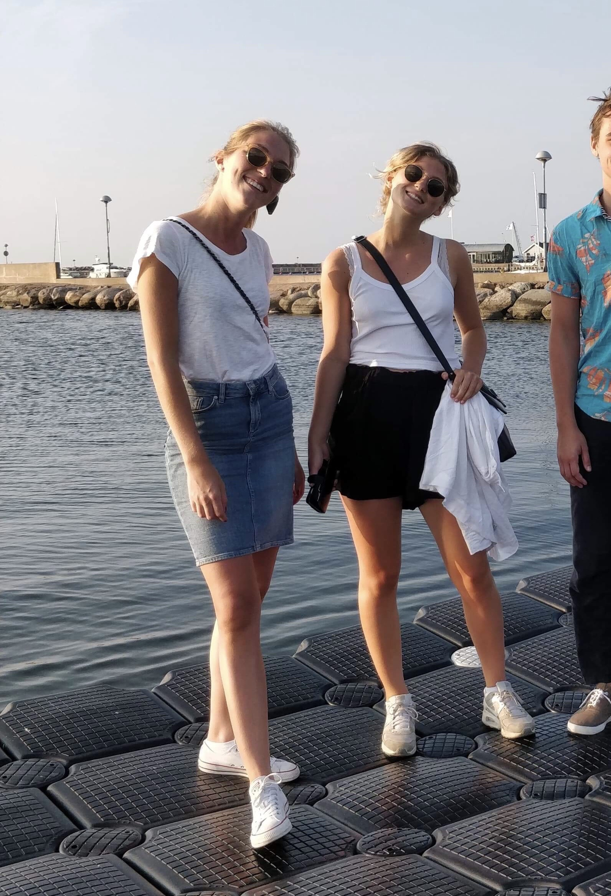

Idag startar vi med en limited edition-intervju. Det är en nämligen en intervju med två personer och dessa personer är inga mindre än sektionens två ledamöter! Intervjun är, som ni kanske vet vid det här laget, i samband med rekryteringsprocessen och ni kan söka alla möjliga poster [här](https://d-sektionen.se/sok-fortroendeposter-vintermotet-2020/)!

* * *

## Vilka är ni? (Namn, program, intressen, etc.)

Sophie Ryrberg heter jag, är 23 år gammal göteborgare som just nu läser tredje året på IT-programmet. Förutom att tycka det är väldigt roligt med möten av alla dess slag så älskar jag att hänga i stallet och har haft egen häst i många år, men eftersom det är lite svårt att få ihop hästliv med studentliv så är hästen kvar i Göteborg och jag får hälsa på honom när jag är hemhemma. Just nu så gör jag inte så mycket mer på fritiden än styrelse- eller STABEN-arbete. 

Jag heter Linn Hallonqvist, är 23 år, kommer från Örebro och pluggar år 4 på IT. Utöver skolan och styret så spelar jag basket i Linköpings damlag. Jag har tidigare varit kassör i Donna och tycker att det är väldigt kul och givande att vara sektionsaktiv. Man får lära sig nya saker och lära känna nytt roligt folk.

<!--more-->

## Berätta mer om posten som ledamot.

Ledamot är en ny post som vi är de första som sitter på. Det är en väldigt öppen post och beskrivs i reglementet som “ska vara styrelsen behjälplig” och är ungefär det vi har gjort hittills. Man kan göra så väldigt mycket olika med den här posten och det är rätt mycket upp till de som blir valda samt styret vad man som ledamot ska lägga fokus på. Eftersom vi två är de första på posten är en ganska stor del av vårt arbete att forma posten. Vi har tagit över vissa ansvarsområden som tidigare låg på intendenten men försöker även ta fram mer strategiska uppdrag som ledamöter kan jobba med. 

För att ge några konkreta exempel på vad vi har gjort har Sophie varit nyckelansvarig och styrt i Inspirationsföreläsningen. Linn har varit bokningsansvarig och varit involverad i kansli-kickoffen och sektionsaktivas kickoff. 

## Vad är roligast med att vara ledamot?

Att man är flera på samma post. Trots att inte vi gör allt tillsammans är det väldigt kul att vara “ett par” och styret kallade oss B1 och B2 ibland när vi hade gjort väldigt mycket tillsammans. Men att helt enkelt ha möjligheten att kunna dela på mycket och att alltid ha någon att bolla tankar med. 

Att ha chansen att kunna lägga fokus på någonting man redan innan vet att man vill jobba med. 

## Bör man ha några erfarenheter för att söka ledamot?

Finns inga rätt eller fel när man söker ledamot, såklart väldigt positivt om man har något tidigare engagemang som man kan ha kunskap av i styret men det är absolut inget krav! En person som har noll erfarenheter men en vilja kan vara minst lika bra på den här posten än en som varit med i 10 utskott tidigare!

## Vem ska söka ledamot?

Vi tycker att man ska gilla att sitta i möten och diskutera ämnen som rör sektionen. Man ska bry sig om hur sektionen arbetar och vilja utveckla och ta hand om den. 

Även bra om man är driven så man kan jobba självständigt när det behövs! 

Kul om man redan innan man söker har har någon idé som man skulle vilja jobba vidare på under året. 

## Vem i styret har godast matlådor? 

Linn köper ofta thai eller indiskt och har i matlådorna medan Sophie enbart dricker shakes så vi gissar att vi inte får säga oss själva. Men vi ger den nog till Mimmi, bästa var när hon kom med en färdigmonterad hamburgare i en matlåda! 

## Något mer att tillägga? 

Sök Styret!! Ett väldigt kul sätt att engagera sig på där man får lära sig väldigt mycket om sektionen och får en hel del kunskaper som man kanske aldrig hade fått annars!
