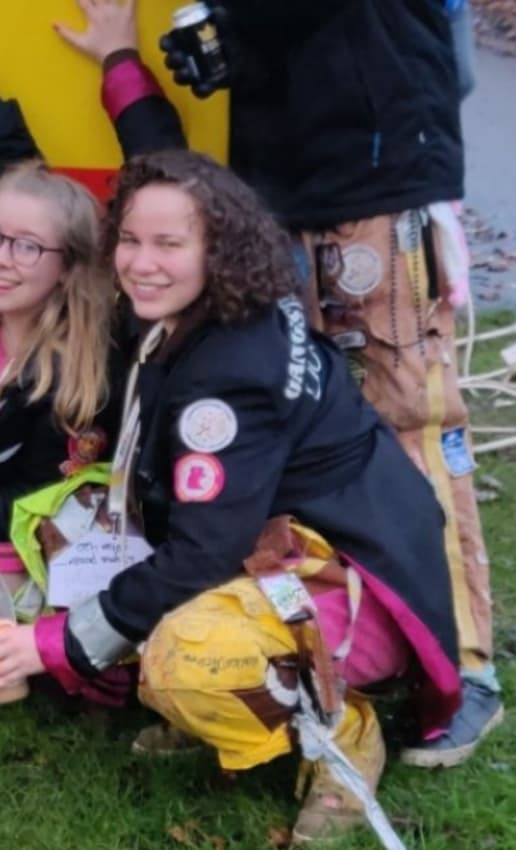

På tredje dagen av rekryteringsperioden gav D-sektionen mig...en inblick i livet som ordförande i utbildningsutskottet. Brinner du lika mycket för kvaliteten på utbildningen som Kimberley, sök posten som utbildningsutskottets ordförande, eller några andra av posterna som ska tillsättas på vintermötet, [här](https://d-sektionen.se/sok-fortroendeposter-vintermotet-2020/).

* * *

## Vem är du? (Namn, program, intressen, etc.)

Mitt namn är Kimberley, kallas för Kimmy av mina vänner och Kim av mina fiender. Jag är 22 år gammal och pluggar fjärde av \[REDACTED\] året på Datateknik. Mina intressen är framförallt tv-spel, serier, grafisk design, programmering, att hänga med kompisar och att skämma ut mig på kravaller. Att vara aktiv inom D-sektionen är även ett stort intresse jag har.

<!--more-->

## Berätta mer om posten som utbildningsutskottets ordförande.

Min post handlar mycket om att ha en överblick över Utbildningsutskottet, att se till att Snordfarna och klassrepparna gör det de ska. Även att planera och hålla i pluggstugor, möten med Snordfarna samt kick-off/mid-off/fuck-off/on-off/etc-off för utskottet. Utöver självaste Utbildningsutskottet så sitter man med som ledamot i Styret vilket innebär mycket möten, planering och diskussioner, vilket alltid är kul! 

## Vad är roligast med att vara utbildningsutskottets ordförande?

Allt glutenfritt fika och att få känna sig lite viktig. Utöver det så tycker jag att det är extremt kul att sitta med i Styret, det är som nämnt tidigare mycket möten och diskussioner vilket jag personligen tycker är svinkul för jag älskar att prata och framföra mina åsikter. 

## Bör man ha några erfarenheter för att söka utbildningsutskottets ordförande?

Det kan vara bra ifall man har varit klassrepp eller Snordf innan, mest för att man då har lite mer insikt i vad man under året ska göra inom utskottet. Jag hade inte varit något av det innan jag sökte och har klarat det ganska bra så det är inte ett krav utan snarare en liten bonus. Att ha varit lite aktiv inom sektionen är även det en bonus, mest för att man då ofta har lite bättre koll på hur den fungerar. Men jag vet inte ifall det är någon erfarenhet som man bör ha, det viktigaste är helt enkelt att man är taggad.

## Vem ska söka utbildningsutskottets ordförande?

Någon som är taggad, strukturerad och redo att styra en ganska så stor grupp. Iom att UtbU är ett utskott på cirkus 45 pers är det alltid bra att ha lite tagg för att öka gemenskapen inom utskottet. Utöver det så ser jag gärna en person som ser positivt på att gå på möten och har förmågan att se till att folk gör det som de ska. 

## Varför skräms ni så mycket i UtBu?

Bra fråga, jag tror mycket av det grundas i att vår yttersta uppgift är att skrämma examinatorer så pass mycket så att de fixar kurserna så att de blir bättre. Därav har vi lite av en spooky vibb.

## Något mer att tillägga?

Hör gärna av dig ifall just DU är taggad på att söka posten och har lite frågor/funderingar! Jag nås via mejl (utbu@d-sektionen.se), facebook, tinder eller brevduva. Alternativt hugg tag i mig när jag sitter i Nettan, är där ganska så ofta.
