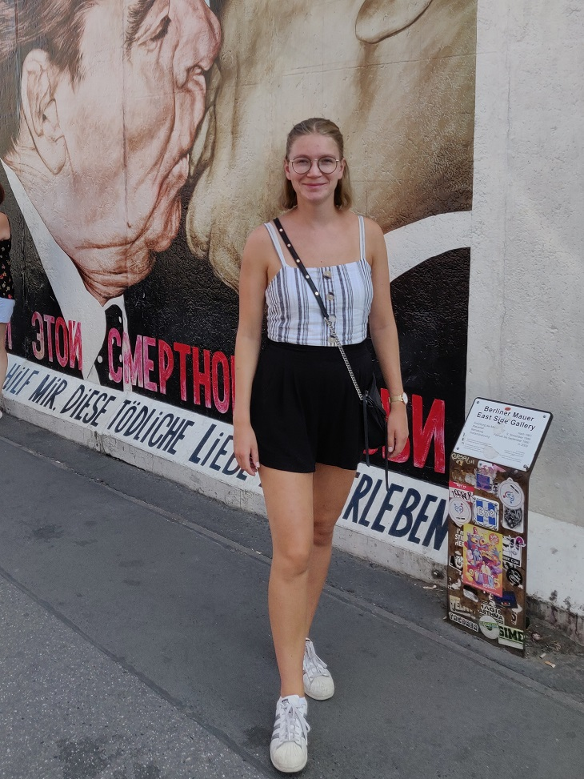

Vi startar morgonkaffet med att lägga ut den 3:e intervjun av alla 13 rekryteringsintervjuer! Vi fortsätter med poster inom styret och en viktig pusselbit i styret är såklart vice ordförande. Sök denna post eller någon annan post som ska tillsättas under vintermötet [här](https://d-sektionen.se/sok-fortroendeposter-vintermotet-2020/)!

## Vem är du? (Namn, program, intressen, etc.)

Jag heter Mimmi Cromsjö är 23 år och går 4e året på IT. Har tidigare engagerat mig i Donna, NärU och LINK. På fritiden tycker jag om att göra det mesta förutom att kolla på serier eller film.

<!--more-->

## Berätta mer om posten som vice ordförande.

Som vice har man ansvaret över kansliet, i år har jag hållit kanslimöte varannan vecka och utöver det haft individuella träffar med alla utskotten. Som vice försöker jag hjälpa utskotten om de stöter på utmaningar i deras arbete samt att jag försöker se till att det fungerar bra med samarbeten mellan utskott. Jag har roddat med kanslikickoff och sektionsaktivas och det kommer jag fortsätta med i vår också! Som vice ser man också till att alla kansli- och utskottsmedlemmar får representationskläder. Man är även delaktig i sektionsmöten och kan alltid agera stand-in om ordförande skulle bli magsjuk.  

## Vad är roligast med att vara vice ordförande?

Arbeta tillsammans med styret. Lära känna alla i kansliet och ta del av vad de jobbar med i sina utskott. Se Dag småfnittra åt alla dumma saker vissa av oss andra säger.

## Bör man ha några erfarenheter för att söka vice ordförande?

Det är bra om man har lite koll på vad som brukar hända på sektionen.

## Vem ska söka vice ordförande?

Den som är taggad och engagerad. Man ska tycka om att ta initiativ och driva saker.
