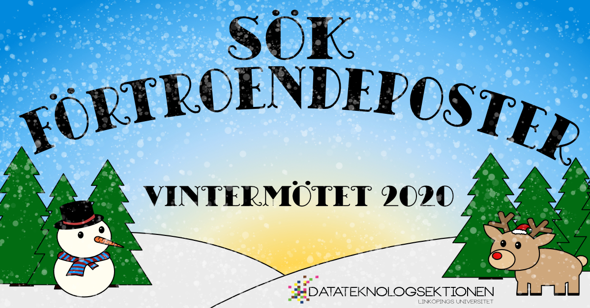

**OBS:** Notera att ansökningsperioden förlängts till och med fredagen den 3:e januari.

Den 3:e februari är det dags för sektionens vintermöte och det innebär också att nya poster på sektionen ska tillsättas inför det kommande verksamhetsåret 20/21!  
  
Känner du att du vill engagera dig i sektionen? Sitta med i styrelsen? Anordna DÖMD? Anordna LINK? Hjälpa till att anordna en massa roliga aktiviteter? Vara med i sektionens damförening? Då ska du passa på att ansöka till någon av posterna som ska väljas in på sektionens vintermöte!

<!--more-->

De poster som ska fyllas är:  
  
Sektionsordförande 20/21  
Sektionskassör 20/21  
Vice ordförande 20/21  
Sekreterare 20/21  
Utbildningsutskottets ordförande 20/21  
Arbetsmiljöombud 20/21  
Styrelseledamot 20/21  
Aktivitetshanterare, Aktivitetsutskottet 20/21  
Aktivitetskassör, Aktivitetsutskottet 20/21  
Chief, D-Group 20/21  
Kassör, D-Group 20/21  
Ordförande, Donna 20/21  
Kassör, Donna 20/21  
Projektledare, Arbetsmarknadsgruppen (LINK) 20/21  
Kassör/Vice projektledare, Arbetsmarknadsgruppen (LINK) 20/21

* * *

## Ansökan och nominering

### D-sektionens styrelse

[Ansökan](https://forms.gle/CLn46ANtjJAqPp9MA)  
[Nominering](https://forms.gle/Yao25QYu6TVNMidf7)

### Aktivitetsutskottet, Aktivitetshanterare eller Aktivitetskassör

[Ansökan](https://forms.gle/Qt3Yxi623ndZ4xuN9)  
[Nominering](https://forms.gle/4WhKARFzWrCu3vKj7)

### D-Group, Chief eller Kassör

[Ansökan](https://forms.gle/kG7WkRZyU6NjoEAd8?fbclid=IwAR3biwSu48UeOzBKQnX2whUmdwmJvYPKgUCZAWtImHsy7Dd4pvon8wwAVE8)  
[Nominering](https://l.facebook.com/l.php?u=https%3A%2F%2Fforms.gle%2FmjntrtAQfq2XJU1s6%3Ffbclid%3DIwAR0Jv6jeOvQtz7udhKmrLkWWz5qHWs1lericmVgK_3-GVrysx-oFGbWCR0Q&h=AT0OlPPBEXYskfXAGDGk8wGt-XJwSoUhlbkl_ZSjvs1UNkCXIecNWbL7KdPzmU_eybbVDkz-gkqfeE3U72O_W2JPDIPDtoEvHT69YJtFxpQ8t0-8g-MVLM_kMi31rnvGmcI)

### Donna, Ordförande eller Kassör

[Ansökan](https://l.facebook.com/l.php?u=https%3A%2F%2Fforms.gle%2F45B2PBmouPkBnfNM6%3Ffbclid%3DIwAR2tCpLGAN7Vrt5kd9M1lBB_KUT787hwu26o4-5TwKT6nAHxSF1aPuLRf3A&h=AT3pqr1kpd4gPfsoCRCutrSQqQ-Fv3sr_7X-qOsDNlrRLpenWbtv2Ymbx1sAjPCjO92yOFw18cpPbnNrc3AiMz1fPspSgbK-L0lCw87UBVC_XxvEHkLenj0-jss0OQvmr50)  
[Nominering](https://l.facebook.com/l.php?u=https%3A%2F%2Fforms.gle%2FrWKz3V4UtqwSe1y27%3Ffbclid%3DIwAR19ocH92TgkYUfe_4uW7c53Ym06Pg2ECptjgUrZrX17sLWxPoeFRZRxxwA&h=AT1tSgM_Kvc8WRpcayda7PCNVjAPGpkmNBKe-BRA8FVGghb7lLL9REoBxEyUdnDmuoWhyWql1u40nqBRWnA2DXF2A01bxX15yqiCEMvBUped6sObBrChbM5wVo4G5WFAxTM)

### Arbetsmarknadsgruppen (LINK), Projektledare eller Kassör/Vice projektledare

[Ansökan](https://l.facebook.com/l.php?u=https%3A%2F%2Fforms.gle%2F27uyWFHGWPyyonhr8%3Ffbclid%3DIwAR2zZHO8EtNrIbkHEZEn12SEcX7p7IpsSIYKVCbNw8P50PH2z4oF8HQ8ZQU&h=AT0B8cbBPutpcTWOFIfLgmWChIzgNNxy6cdv26rg1xBBx3JEVtd--a7Zg2WgeNwZp6IO5Rn00S6i8kVqLCAa9ur-RF3iNcpigbDT4agNT1Nb4r253L_LbHyPDMVmBGEQiQA)  
[Nominering](https://forms.gle/PtJcgA9WBLDv6rj19?fbclid=IwAR2Q7PRqyfft1sekvBP8ZWy3BaN8Z5HsHXc-qMMyaU-yg2rHhIsNj08zLk0)

* * *

Sista dagen att söka förtroendeposter är 3:e januari. Observera att ansökningsperioden för Projektledare och Kassör för LINK stänger den 19:e januari då dessa väljs in på Y-sektionens möte.  
  
Har du några frågor om en post? Ta chansen och fråga personen som sitter på posten just nu, kontaktuppgifter hittar du [här](https://l.facebook.com/l.php?u=https%3A%2F%2Fd-sektionen.se%2Fstyrelsenkansli%2F%3Ffbclid%3DIwAR0zMRjXp4yj7QruIkS0rsQy6i46y1YyaOS7nRar15kvWatGRSfaOKN6XMQ&h=AT1wcoj98cuPjspcwR_SrKMElq8M78d73XwqUp88fw5ZOhFeNgwYmVRiPwpB0yLRYXA4eFdaPczNlg1cAvvoY26_v9uUoZr-O_IkF_70OgniH10ES9aEHhAzBlRJHXp_gZs).  
  
Har du några frågor som rör ansökningsprocessen? Hör av dig till Valberedningens ordförande på [val@d-sektionen.se](mailto:val@d-sektionen.se)
