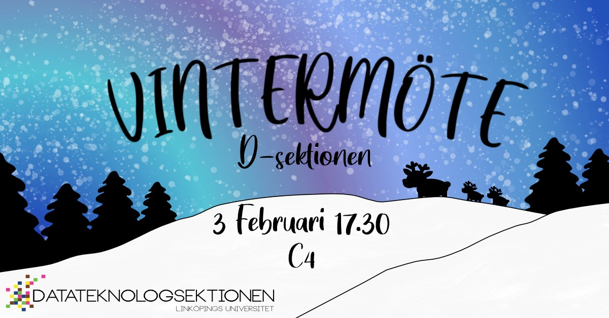

Medlemmar i sektionen kallas till ordinarie vintermöte den 3 februari 2020. Detta är ett av sektionens tre ordinarie sektionsmöten. Sektionsmöten är sektionens högst beslutande organ där du som medlem har möjligheten att vara med och besluta om sektionens verksamhet.

**Datum:** 3 februari 2020  
**Tid:** 17:30  
**Plats:** C4

Mer information finns på:  
[www.d-sektionen.se/vintermote](http://email.mailgun.d-sektionen.se/c/eJxdjTsOgzAQRE-Du1jrD_4ULogU7uHgVXACBsE6XD-uI42meBq9SQGT9tqxHCRIACFBaBCgueDeDlaOg7K9fzgF907DGvPyqoWn24kfylvBwk9kc5BTNEbEqBF7a1Tvp6eViM5ZEVtZtoSZaO_U0Mmx5bquP0mD31wIj3UjZEd4b_NRQZn2elJNWIgvubbhD6JHNk4)

Från sektionens stadgar:

**§5.14 Vintermötet**  
Det åligger sektionsmötet att, på vintermötet, för nästkommande verksamhetsår:

- Välja sektionsordförande
- Välja sektionskassör
- Välja vice ordförande
- Välja sekreterare
- Välja utbildningsutskottets ordförande
- Välja arbetsmiljöombud
- Välja styrelseledamöter
- Välja aktivitetshanterare
- Välja aktivitetsutskottets kassör
- Välja festeriets ordförande
- Välja festeriets kassör
- Välja Arbetsmarknadsgruppens ledning enligt Datateknologsektionens reglemente.
- Välja damföreningens ordförande
- Välja damföreningens kassör
