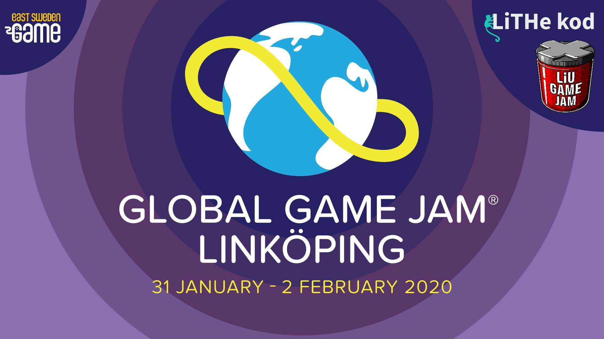

Global Game Jam 2020 är världens största game jam som tar plats runt om hela jorden. Det är ett event där programmerare, artister och gamers tillsamans skapar spel; både datorspel och bordsspel. Vi i **LiTHe kod** vill bjuda in D-sektionens medlemmar till detta event. Under eventet så får deltagarna ett i förväg okänt tema, de ska sedan under 48 timmar gå ifrån att spåna ihopa en idé till att utveckla en färdig spelprototyp. Riktigt kul och mycket lärorikt. Inga speciella förkunskaper krävs och eventet är gratis.

<!--more-->

**Datum:** 31 January - 2 February

**Läs mer** i Facebookeventet [här](https://www.facebook.com/events/441093866518643/).
