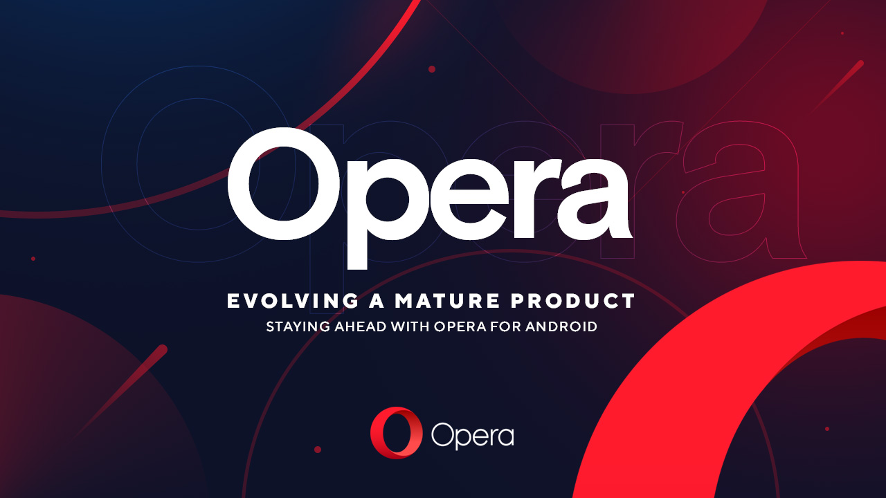

Did you know that Opera’s Android browser, used by more than 70 million users worldwide, is being developed in our office in central Linköping? Come and catch a glimpse into some of the challenges of working with a mature product with strong stability and quality requirements, while at the same time keeping a high pace of evolution and innovation to stay on the forefront. Follow the path we use to turn crazy ideas into released features. Welcome!  
  
Each registered attendee will be served free lunch from Kårallen.

When? 28/1 kl 12:15 - 13:00  
Where? C2

Sign up here: [https://forms.gle/FK6Kd7xyfp7p1ZWW8](https://forms.gle/FK6Kd7xyfp7p1ZWW8)
