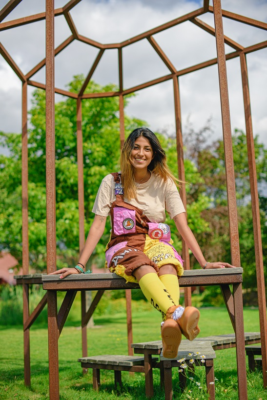

Hejsan!

Hoppas ni alla har haft en gott jul, ett god nytt år och att ni inte har glömt bort att registrera er på terminens kurser!

Vi rivstartar terminen med denna intervju med Amitis från D-Group som del av vår intervjuserie “Sektionsaktiv i fokus” där vi hoppas ge lite inblick i livet som sektionsaktiv!

Trevlig läsning, och ha D gott!

## Vem är du? (Namn? Vilket år? Program? Intresse?)

Jag heter Amitis, är 22 år och kommer ifrån Göteborg. Jag har faktiskt tyvärr hoppat av, så jag pluggar inte IT längre. Jag läser fristående kurser just nu. Mina intressen, jag gillar att dansa, hänga med kompisar, älskar hundar och att vara med D-Group typ.

## Vad är din post i D-Group?

Biljett och U-lag! Det innebär att jag ansvarar för alla biljetter, vilka som får förköp och så håller jag i biljettförsäljningar. Jag präglar och stämplar även alla biljetter som säljs. Som U-lag har jag alla lag på DÖMD, så både U-lag och alla lag från skolan. Det är typ det jag håller reda på.

<!--more-->

## Hur är livet som en Biljett och U-lag:are i D-Group?

Det är både lugnt och inte lugnt skulle jag säga. Just nu är det ganska lugnt men under DÖMD kommer jag att vara väldigt stressad, för det är inte bara att sälja biljetter, det är också att prägla dem, stämpla dem och sånt tar lång tid för det är cirka 2500 biljetter som jag för hand ska prägla. Det tar tid och det gör ont i händerna.

Biljettförsäljning är ju att vara på plats och sälja biljetter i några timmar, klockan 6 på morgonen på biljettsläppet men även andra tillfällen som till exempel förköpstillfällen. Så det är mycket tid som går åt till att bara vara närvarande.

När det kommer till lagen är det ju att nå ut till universitet i hela Sverige och fixa boende och faddrar till dem, fixa så de får va med på allting osv. Alla ska ju ha det bra liksom! DÖMD kommer vara det jobbigaste för mig och hela D-Group.

## Hur taggad är Biljett och U-lag på DÖMD?

Jag är skittaggad, alltså U-lag är ju mitt största ansvarsområde så jag ser jättemycket fram emot det. Det ska bli askul att komma i kontakt med andra studenter från andra universitet.

## Vilket utskott hade du valt som labbpartner i den skitsvåraste programmeringskursen?

LiTHe kod, kanske! Är de ett utskott?

## Vilket utskott hade “ragequittat” den skitsvåraste programmeringskursen?

D-Group, nej jag skojar bara. Men jag vill ju inte trampa på någons tå nu så vi säger D-Group, vi är ju ofta upptagna med massa annat.

## Vilket utskott hade varit handledare till den skitsvåraste programmeringskursen?

Det hade varit Pubutskottet som jag själv är med i. Väldigt duktiga och härliga människor! Jättebra labbassar tror jag!

## Vilken är din favorit av de mäktiga DÖMD-låtarna?

Oj! Det finns ju så många! Den ena är DÖMD-låten från 93/94. OCH, den andra är “Dags för DÖMD” 15/16!

## D eller d?

Stort D.

## Vilket är ditt favoritgodis?

Godis? Får man ta kladdkaka?

## Vad vill du hälsa alla D:are där ute?

Tagga DÖMD!

* * *

P.S.: Just D-Group ska snart hålla i sittningen Propexus Glador. Är du intresserad av att gå? Kika in i [Facebook-eventet](https://www.facebook.com/events/2742528949118386/), sista anmälningsdag är måndag 27/1.
