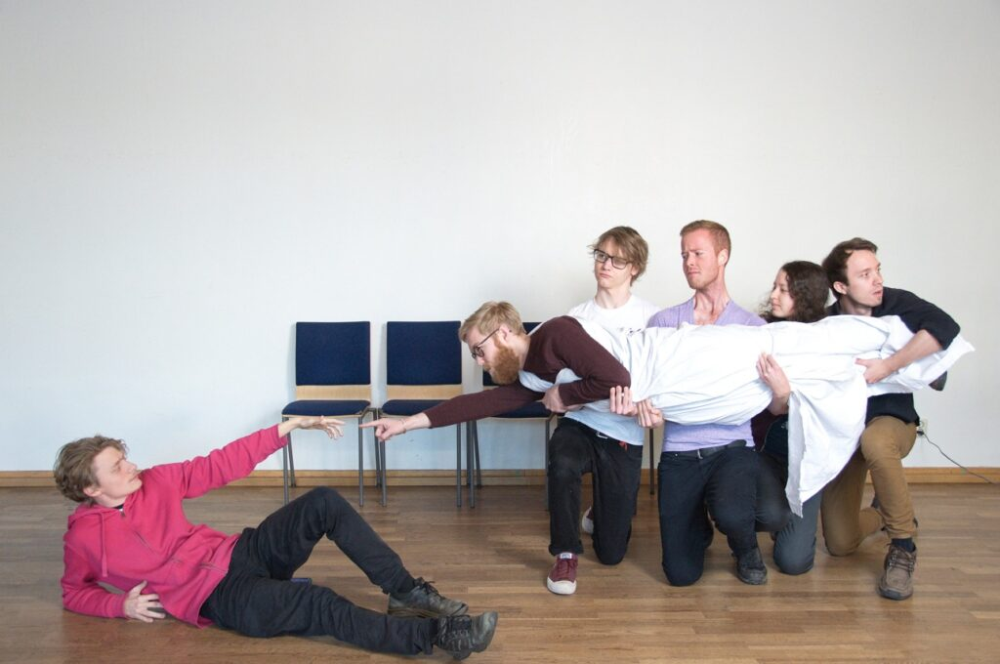
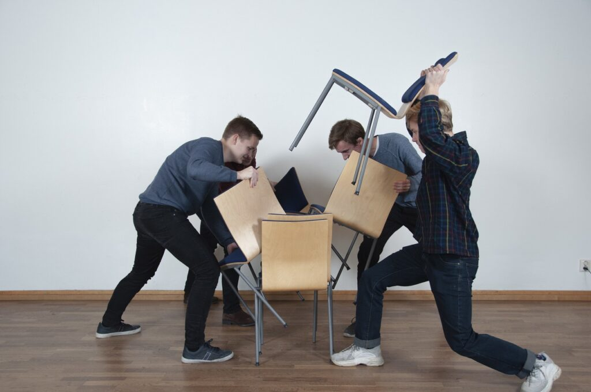

- 
    
- 
    

Äntligen finns alla bilder från sektionsfotograferingen uppe i sektionens [fotoalbum](https://d-sektionen.se/filarkiv/fotoalbum/)!

Under sektionsfotograferingen fick alla klasser samt utskott på sektionen möjligheten att bli fotograferade med både en proper gruppbild och en spexbild. Tack till alla som kom och bidrog till ett fint album.

Som del av sektionsfotograferingen hölls också en tävling för att kora den bästa spexbilden från klass respektive utskott. En enig jury från Infoutskottet har nu utsett två vinnare:

- **Bästa spexbild, klass:** U4, med deras väldigt minnesvärda homage till den klassiska målningen "The Creation of Adam" av Michelangelo.
- **Bästa spexbild, utskott:** Webbgruppen, med deras fyndiga, improviserade fysiska manifestation av en merge conflict.

Stort grattis till vinnarna! Se alla bilder från både nu och förr i sektionens [fotoalbum](https://d-sektionen.se/filarkiv/fotoalbum/).
