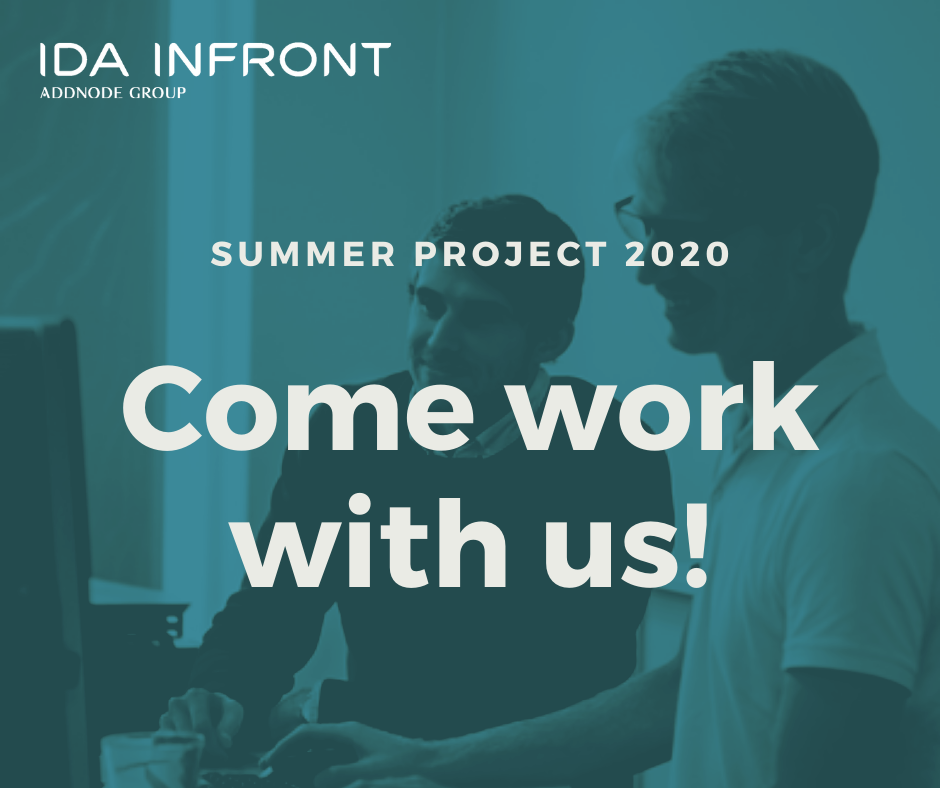

**Help us** develop a new and improved pre-ingest for our electronic archive – iipax archive! As a student you’ll get the opportunity, along with another couple of students, to develop your skills as a programmer during a summer. Read more and apply through [https://www.idainfront.se/karriar/lediga-tjanster/](https://www.idainfront.se/karriar/lediga-tjanster/)
