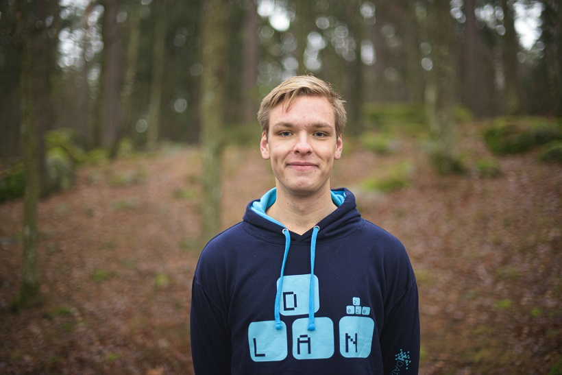

God morgon, god middag, god kväll alla D:are! Har ni någon gång gått och funderat över vilket av alla D-sektionens utskott som hade klarat sig bäst i Hunger Games? Det har Gustaf Udd från D-LAN! Och till er glädje följer här en intervju med honom som nästa stopp på vår sektionsaktivas-turné!

Just D-LAN är i full fart med att fixa årets LAN. Måndagen den 17/2 är det biljettsläpp, så kika in på deras [Facebook-event](https://www.facebook.com/events/222265555449725/) eller på [d-lan.se](http://d-lan.se) för mer info.

## Vem är det vi pratar med? (Namn, program/klass, intressen)

<figure>

<figcaption>

Foto: [Cecilia Olsson](https://www.facebook.com/ceciliaolssonphotography/)

</figcaption>

</figure>

Gustaf Udd, U3. Intressen varierar lite fram och tillbaka, men några intressen verkar hänga kvar. Oftast spenderas min tid på diverse engagemang, matlagning, och att försöka varva ned på kvällen efter någon kopp för mycket kaffe från Baljan.

<!--more-->

## Vad är din post i D-LAN och vad innebär titeln?

Posten kallas för _spons_, och som namnet antyder handlar posten till stor del om att söka sponsring från företag och andra eventuella parter. Personligen skulle jag kalla posten för _företagsansvarig_, då postansvaret handlar mer om kontakt och förhandlingar med företag och externa parter snarare än att bara fiska efter pengar; en länk mellan förening och företag kan man säga.

## Hur har spons-jakten gått inför årets D-LAN?

Den har gått utmärkt! Intresset hos företag att samarbeta är brinnande hett, så det har varit mycket kontakt med en mängd olika företag inför detta år, och även lovande kontakter inför kommande år. D-LAN blir även dubbelt nöje för vissa företag som primärt är på plats för att träffa härliga och drivna studenter, men som samtidigt blir att delta i turneringar och tävla mot studenterna. Sådant uppskattas av alla, och ger en väldigt härlig koppling mellan företagen och studentlivet.

## Kan du med egna ord beskriva vad D-LAN gör?

I kortaste möjliga sammanfattningen så anordnar vi som kommité ett LAN för alla LiUs studenter; mer invecklat behöver det inte vara. 

## Hur har förberedelserna sett ut i gruppen under årets gång?

Inval av kommité sker av projektledaren under september, och därefter kör arbetet igång ganska omgående. Mycket planering sker under den första perioden, där mål och en ungefärlig arbetsplanering för hela det kommande arbetet sätts upp. Arbetet och planering delas för vardera person upp i ett postspecifikt arbete, och ett för gruppen gemensamt arbete. Med planering satt arbetar man mot att nå sina uppsatta mål, och se till att evenemanget blir så pass bra som möjligt!

## Hur ser förberedelserna ut nu när D-LAN börjar närma sig?

Det ser bra ut, allting är i fas. Planeringen har fungerat suveränt, och med den sista etappen innan evenemanget teoretiskt lugn; hur det fungerar praktiskt sett återstår såklart att se. PR-perioden är i full gång, och vi spenderar tid lite här och var runt om campus med att visa upp oss, och se till att folk som eventuellt tidigiare inte hört något om D-LAN ska få chansen att upptäcka något nytt och spännande. Har man skarp syn har man troligtvis även sett våre fina lakan och posters som är uppsatta längs corson och på diverse anslagstavlor runt om campus.

## Börjar nervositeten smyga sig på gruppen nu?

Än så länge finns det ingen märkbar nervositet, men den kommer ju av erfarenhet alltid fram tids nog innan evenemanget. Om du frågar mig samma fråga nästa vecka lär jag nog inte vara riktigt lika säker på mitt svar.

## Hur stolt är du över ditt tidigare krans-skägg?

Otroligt stolt! Det fanns många som hånade mig och tyckte jag var ful men jag kände en stolthet i det liksom. Man ska inte klanka ner på det,ett skägg är ett skägg ändå.

## Varför odlar du inte krans-skägg nuförtiden då?

Alltså… det var väl kanske inte världens vackraste skägg ändå med facit i hand. Att vara skäggfri tror jag passar mig bättre, men vem vet när skägget får ett nytt försök att visa sig?

**Alla D-sektionens utskott är nu tävlanden i Hunger Games: Hur långt tar sig D-LAN?** 

Jag vill påstå att vi skulle tas oss långt, vi har ett gäng riktigt fiffiga människor med oss. Som grupp tror jag vi åtminstone skulle överleva vildmarken med lite ledning från Arvid, men att överleva alla andra utskott kan bli en större utmaning.

## Vad hade ni haft för strategi?

Jag tror att vi först och främst hade försökt ta fram elektricitet, och sen dra ihop några primitiva datorer och bjuda in folk till Hunger Games största (enda?) LAN. Någonstans där kan vi säkert rigga upp en fälla på något klurigt sätt när vi har folk samlade. Överlevnadsmässigt har förmodligen en uppladdad kiosk med panpizza och energidryck att nyttja, så hunger-delen av “Hunger Games” kanske inte är lika allvarlig för oss ändå.

## Vem vinner? 

Vi? Lite självförtroende måste man väl ha.

## Vem elimineras först?

STABEN! I karaktär springer man inte ifrån någon. 

**_Efter att mikrofonen hade stängs av ändrade Gustaf sitt svar till InfU som första eliminerade med anledningen att de hade_** _“Gått fram och hälsat på alla, kolla hur de mår och så. Så vinner man inte Hunger Games!”_

## Energidryck eller läsk?

Energidryck!

## Föreläsning måndag morgon eller fredag kväll?

Måndag morgon, utan tvekan.

## D-LAN eller hemma-LAN

D-LAN???

## Favoritgodis?

Allt! (Tyvärr)
