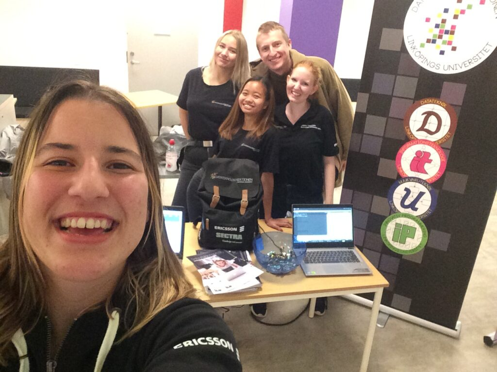

Här kommer en intervju med Marknadsföringsutskottets ordförande!

Är du intresserad av denna post? Se dessa länkar för att söka eller nominera någon du tror skulle passa:

[Ansökan](https://forms.gle/yeFf7u3c4U8M3KvN8)  
[Nominering](https://forms.gle/u7vYvgugzs7XRprb9)

Ansökan och nomineringar stänger 2 april.

## Vem är du?

Jag heter Rosanna Isaksson och är en pepp och taggad 22-åring som pluggar mitt tredje år på Mjukvaruteknik. På fritiden gillar jag att träna (TIPS: Gå med i “Let’s go to D gym”- gruppen) , umgås med familj och vänner samt att engagera mig i studentlivet!

## Kan du ge en kort sammanfattning vad Marknadsföringsutskottet gör?

Marknadsföringsutskottet arbetar främst med att locka fler gymnasieelever till Datateknologsektionens utbildningar genom att stå på mässor, hålla i hemmissioneringen, besöka gymnasieskolor och framförallt arrangera D-TOUR (TAGGA D-TOUR 2021)!

<!--more-->

## Vad innebär det att vara ordförande i MafU?

Att vara ordförande för MafU handlar om att leda utskottet mot vårt mål som är att locka fler gymnasieelever till våra utbildningar. Även att hålla i möten och fungera som ett bollplank för andra utskottsmedlemmar. Utöver representerar man Marknadsföringsutskottet i kansliet och även på möten med studienämnden.

## Vad har varit roligast?

Allt! Har varit otroligt kul att få hänga med ett kanongäng och arrangera härliga event tillsammans. Det bästa har varit den positiva responsen vi har fått från gymnasieeleverna på våra event.

## Hur känns det att få lämna över postarbetet till din bebis?

Ska bli kul att få en bebis och att få dela tankar och idéer om MafUs framtid.

## Vad skulle du säga till någon som är osäker på att söka ordförande för MafU?

Sök! Det du inte kan kommer du att lära dig under året! 

## Något att tillägga?

TAGGA D-TOUR 2021!

## Hur marknadsför man sin blocket-annons bäst?

Man delar den överallt på sociala medier och pratar om den med folk man träffar.

* * *

Tycker du posten låter som något för dig, eller kanske för någon du känner? Se dessa länkar för att söka eller nominera någon du tror skulle passa:

[Ansökan](https://forms.gle/yeFf7u3c4U8M3KvN8)  
[Nominering](https://forms.gle/u7vYvgugzs7XRprb9)

Ansökan och nomineringar stänger 2 april.
