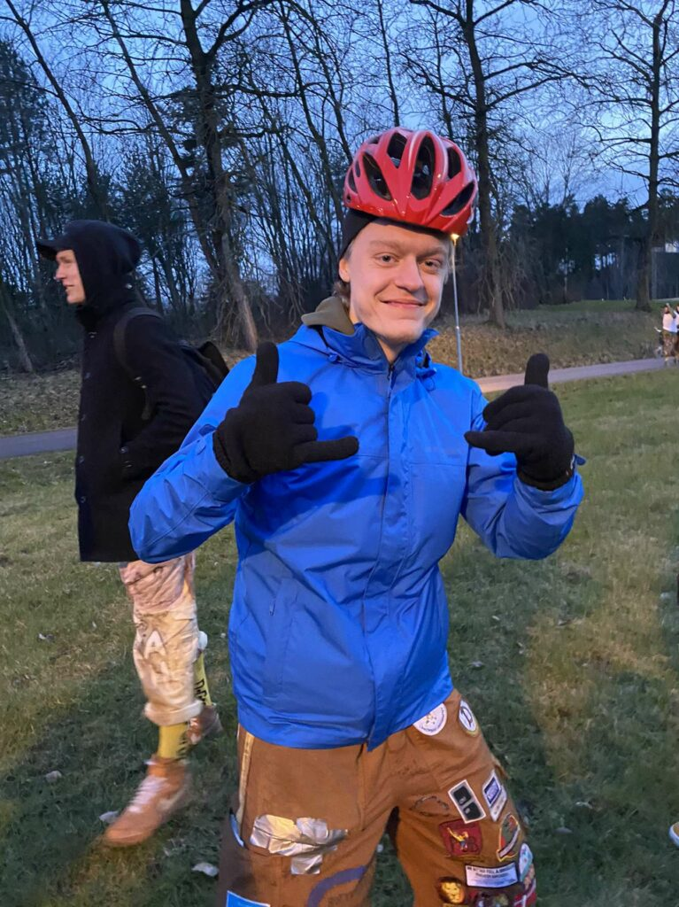

Här kommer en intervju med Studienämndsordförande på D-programmet!

Är du intresserad av denna post? Se dessa länkar för att söka eller nominera någon du tror skulle passa:

[Ansökan](https://forms.gle/yeFf7u3c4U8M3KvN8)  
[Nominering](https://forms.gle/u7vYvgugzs7XRprb9)

Ansökan och nomineringar stänger 2 april.

* * *

## Vem är du?

Mitt namn är Casper Jensen, jag är en 20 år gammal stockholmare som råkat hamna här i linkan för att plugga. Jag går just nu andra året på datateknik vilket innebär att jag hoppade på utbildningen direkt efter gymnasiet. På fritiden gillar jag att engagera mig i olika saker så som VilleValla, D-snordf och mitt senaste äventyr STABEN. 

## Kan du ge en kort sammanfattning vad studienämnden gör?

Studienämnden är helt enkelt jag och alla klassrepparna som pluggar D. Studienämndens uppgift är att genomföra utvärderingar av kurserna som studenter på D-programmet läser de första 3 åren.

<!--more-->

## Vad innebär det att vara studienämndsordförande för D?

Det innebär att man får läsa igenom en massa utvärderingar av kurser men också att man får sitta med i PPG för D och U samt DM-nämnden på liu. PPG är programplanegruppen och här disskuterar man hur just D programmet kan utvecklas och vad som fungerar bra och mindre bra. DM-nämnden är nämnden för data och medieteknik vilket är större och mer formell än PPG. Här tas större beslut och här sitter även studierepresentanter från alla D-sektionens program och mediateknik i Norrköping. Men utöver detta får man också sitta med i sektionens kansli vilket är väldigt kul!

## Vad har varit roligast?

Att få en inblick i hur man utvecklar utbildingen och få se en bild av hur liu jobbar med att göra programmet ännu bättre. Det har också varit väldigt kul att få sitta med i utskottet tillsammans med de andra snordfarna och ordförande! 

## Hur känns det att få lämna över postarbetet till din bebis?

Jätteroligt!

## Vad skulle du säga till någon som är osäker på att söka studienämndsordförande?

Det är inte alls så svårt eller tidskrävande arbete och man får ut väldigt mycket av det så jag skulle säga att det är en väldigt bra post om man är ute efter lite ansvar. 

## Är du studienämndsordförande för Dag?

Ja, jag har dock inte sett honom på några utvärderingar på sistone...

* * *

Tycker du posten låter som något för dig, eller kanske för någon du känner? Se dessa länkar för att söka eller nominera någon du tror skulle passa:

[Ansökan](https://forms.gle/yeFf7u3c4U8M3KvN8)  
[Nominering](https://forms.gle/u7vYvgugzs7XRprb9)

Ansökan och nomineringar stänger 2 april.
