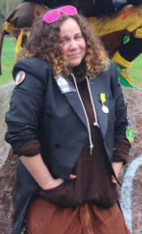

Oj, är det dags för ännu en intervju? Vässa pennorna, för nu ska du utbildas i vad det innebär att vara ordförande i Utbildningsutskottet!

Är du intresserad av denna post? Se dessa länkar för att söka eller nominera någon du tror skulle passa:

[Ansökan](https://forms.gle/xvngctcj51Uq6smd7?fbclid=IwAR3PJcxa4lqE7moOp7cLQAy8ZHwhunIgfQOIKBa_Qb-j35szoF2i_eoJ0jk)  
[Nominering](https://forms.gle/rcyWY8xnENZRLYiG7?fbclid=IwAR1C0risW6M1s1UvU0xbU-tZHwtouDZRMuL4iV8UHEF3QE1tfdaMu9RR4Ew)

Ansökan och nomineringar stänger 2 april.

* * *

## Vem är du?

Tjohej! Kimberley heter jag, jag pluggar fjärde av \[REDACTED\] året på D och är 22 år gammal. Jag har varit runt i en del utskott på sektionen och nu sitter jag som UtbO i sektionsstyrelsen.

## Kan du ge en kort sammanfattning vad UtbU gör?

UtbU är det utskott som har koll på kursutvärderingar, Gyllene Moroten samt håller konversation med nämnden/PPG/LinTek kring utbildningsfrågor. Basically, vi ser till att examinatorer får reda på vad vi studenter tycker om de kurser vi läser.

<!--more-->

## Vad innebär det att vara ordförande i UtbU?

En plats i sektionsstyrelsen, “högsta hönset” i Utbildningsutskottet, en del möten samt ett riktigt roligt och lärorikt år. Ooo och makt, det får man inte glömma!

## Vad har varit roligast?

Kick-offen helt klart, vi arrade en cykelfest vilket var riktigt skoj 10/10 would recommend to a friend

## Hur känns det att få lämna över postarbetet till din bebis?

Kul! Don’t get me wrong - det har varit skoj att sitta på den här posten men även jag, hur ung och fräsch jag än ser ut, börjar bli gammal och är redo att ge över arbetet till en ny och lite fräschare. 

## Vad skulle du säga till någon som är osäker på att söka ordförande?

Go for it! Jag var själv lite osäker på om jag skulle söka men jag ångrar verkligen inte att jag gjorde det! Man lär sig väldigt mycket om sektionen, utbildningen och sig själv (för att va lite cheesy) under året man besitter den här rollen. Om DU går runt och velar på om du ska söka eller inte så kan du alltid skicka ett mejl till mig med lite frågor, jag svarar på allt. 

## Något att tillägga?

Hit me up om du går runt och undrar hur det är att sitta på den här posten, hur det är att vara med i styret eller om du bara har lite frågor! 

## Hur ska ni få folk att inse att ni i Ut-BU inte menar att skrämmas så att nån söker ordförande?

Hmmm… svår fråga, ett alternativ vi bollat runt lite är att dela på utskottet så att vi har Ut-BU och Ildningstskottet (så att det verkar lite mindre läskigt) men problemet där är att det senare blir knassvårt att uttala. Men vi jobbar på det!

* * *

Tycker du posten låter som något för dig, eller kanske för någon du känner? Se dessa länkar för att söka eller nominera någon du tror skulle passa:

[Ansökan](https://forms.gle/xvngctcj51Uq6smd7?fbclid=IwAR3PJcxa4lqE7moOp7cLQAy8ZHwhunIgfQOIKBa_Qb-j35szoF2i_eoJ0jk)  
[Nominering](https://forms.gle/rcyWY8xnENZRLYiG7?fbclid=IwAR1C0risW6M1s1UvU0xbU-tZHwtouDZRMuL4iV8UHEF3QE1tfdaMu9RR4Ew)

Ansökan och nomineringar stänger 2 april.
