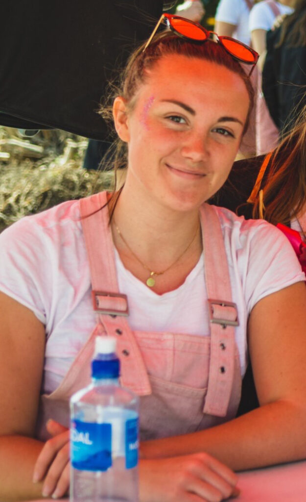

Här kommer en liten intervju med Valberedningens ordförande, som är ansvarig för att processen att ta ut kandidater till alla dessa förtroendeposter går som den ska!

Är du intresserad av denna post? Se dessa länkar för att söka eller nominera någon du tror skulle passa:

[Ansökan](https://docs.google.com/forms/d/e/1FAIpQLScjz7DT5zqPobEcwWi7dwDEieovZ6XkgHGbwMANBtQ0Jzbv0g/viewform)  
[Nominering](https://docs.google.com/forms/d/e/1FAIpQLSfqSOfmsNGUOKuGGGZ55l75fXgQhiDo45oqxKMiJ1aP2EmUXw/viewform)

Sista dag för ansökan och nomineringar är den 2 april.

* * *

## Vem är du?

Jag heter Lovisa Stålebrink, är 21 år gammal och kommer ursprungligen från Smålands skogar. Jag flyttade hit till Linköping för att börja plugga D och nu är jag helt plötsligt inne på mitt tredje år. Att vara sektionsaktiv är något som ligger mig varmt om hjärtat. Jag har tidigare varit med i Donnastyret men just nu går mesta delen av tiden åt till arbetet i valberedningen, där jag sitter som ordförande, samt även STUBBEN. 

## Kan du ge en kort sammanfattning vad valberedningen gör?

Valberedningens huvudsakliga uppgifter är att ta fram lämpliga kandidater till de förtroendeposter som ska väljas in på de tre olika sektionsmötena. Det innebär en hel del intervjuer och beslutsmöten för att ta fram de kandidater som ska nomineras. 

<!--more-->

## Vad innebär det att vara ordförande i valberedningen?

Som ordförande börjar man med att ta ut kandidater till resterande platser i valberedningen som styret sedan måste godkänna. Efter det ser man till att arbetet flyter på, att deadlines följs, delegerar ut arbete om det behövs, går på kanslimöten och sen pratar man även lite på sektionsmötena om hur rekryteringsprocessen gått till. 

## Vad har varit roligast?

Det absolut roligaste har varit att hänga med resterande ledamöter i valberedningen. Vi har haft en del långa kvällsmöten och hållit i många intervjuer tillsammans. Då man är mellan 5-6 personer så blir man ett ganska tight gäng. 

Sen är arbetet som valberedningen genomför otroligt roligt. Man lär sig mycket om intervjutekniker, får en bra inblick i de olika utskotten och man får vara med och påverka mycket vilka som ska styra och ställa på sektionen.

## Hur känns det att få lämna över postarbetet till din bebis?

Lite tråkigt, då det varit ett roligt och lärorikt år men samtidigt är det alltid mysigt att få en bebis ju!!

## Vad skulle du säga till någon som är osäker på att söka ordförande?

Hör av dig till mig! Jag diskuterar mer än gärna varför man bör söka posten ;)

## Något att tillägga?

Sök, det blir skoj! 

## Vilken sorts val är din favorit? (varför?)

Blåvalen, för att den är enorm!

## Hur många valar får det plats i ett kylskåp?

Det beror helt på hur stort kylskåpet är?!

* * *

Är du intresserad av denna post? Se dessa länkar för att söka eller nominera någon du tror skulle passa:

[Ansökan](https://docs.google.com/forms/d/e/1FAIpQLScjz7DT5zqPobEcwWi7dwDEieovZ6XkgHGbwMANBtQ0Jzbv0g/viewform)  
[Nominering](https://docs.google.com/forms/d/e/1FAIpQLSfqSOfmsNGUOKuGGGZ55l75fXgQhiDo45oqxKMiJ1aP2EmUXw/viewform)

Sista dag för ansökan och nomineringar är den 2 april.
