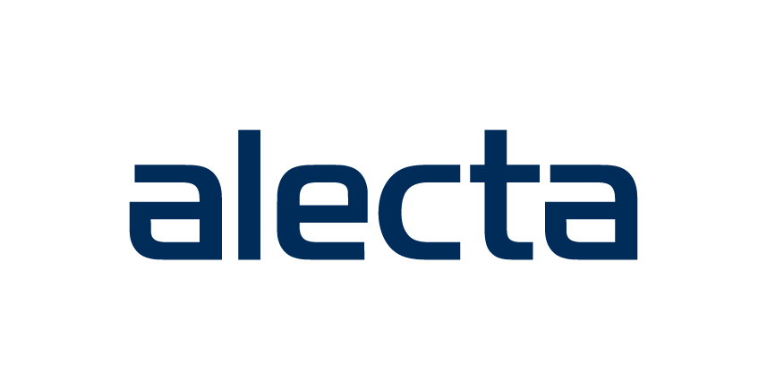

Redo för att kickstarta din IT-karriär? Sök då Alecta Accelerate! En programsatsning på 12 månader, skräddarsydd för dig som vet att IT är området du vill satsa på långsiktigt. Du, tillsammans med övriga deltagare i programmet kommer spela en stor roll för IT-avdelningens resa framåt. Alecta behöver dig som vill utveckla både dig själv, dina kollegor och deras affär. Vi vill att du ska våga fråga, göra misstag, lära dig nya saker och framförallt ha roligt på vägen i arbetet mot Alectas vision - att bli världens mest effektiva tjänstepensionsbolag! 

[Klicka här för att läsa mer om programmet!](https://eur02.safelinks.protection.outlook.com/?url=https%3A%2F%2Fjobs.academicwork.se%2Fannons%2Falecta-accelerate-2020%2F15040631%3Fpreview%3D1&data=02%7C01%7Cfrida.lindberg%40academicwork.se%7C59a10a0c36eb4bafce7f08d7d25d2646%7Cf505412d31504f15a704b6ce122de04d%7C0%7C0%7C637209169824156274&sdata=SCLXN4TacYdQJX6snPY%2FNUP%2Bxj18a4DtwvNXV%2FfNQxw%3D&reserved=0)
