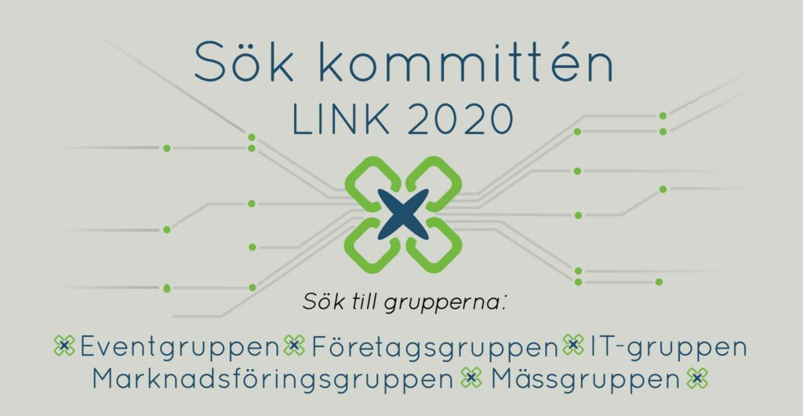

Nu är ansökan till LINK-kommittén 2020 äntligen öppen, och vi söker alla som är taggade att vara del av universitetets största mässa inom data och IT!

Vill du lära känna härliga människor från andra program? Vill du maximera livets roliga stunder samtidigt som du planerar en maxad mässa? Vill du se din planering ge fysiska resultat? 

Ta chansen och sök LINK! Mer info finns i [eventet](https://www.facebook.com/events/3012865485432918/). Ansökan och nominering är öppen fram till den 18:e april 23:45. Sök idag! 

Ta hand om er i dessa tider, vi hörs och ses!

[https://www.facebook.com/events/3012865485432918/](https://www.facebook.com/events/3012865485432918/)
