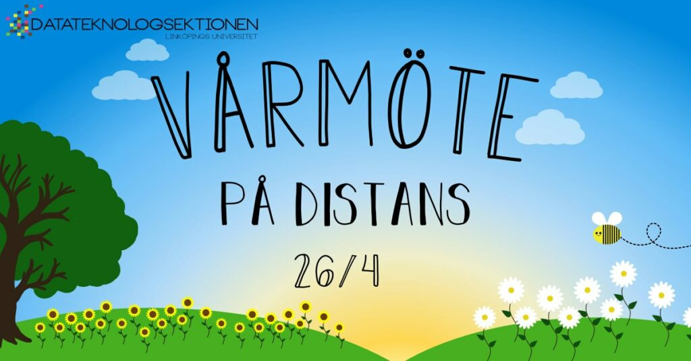

Medlemmar i sektionen kallas till ordinarie vårmöte den 26 april 2020. Detta är ett av sektionens tre ordinarie sektionsmöten. Sektionsmöten är sektionens högst beslutande organ där du som medlem har möjligheten att vara med och besluta om sektionens verksamhet.

\*\*\* Distansmöte \*\*\*  
På grund av regeringens beslut om att förbjuda allmänna sammankomster med fler än 50 deltagare kommer deltagandet på vårmötet att ske digitalt på distans, och ledas av styrelsen från C-huset på campus Valla.

Information om hur du ansluter till mötet kommer att publiceras framöver här i evenemanget, samt på:

[https://d-sektionen.se/varmote/](https://d-sektionen.se/varmote/?fbclid=IwAR1yeL0ANKTl0szN6xzVYG2VyrHXvBRMAnshj3bFelD6Ig2hDb0oYp1efCM)

Där hittar du även anmälan! Anmälan har som syfte att uppskatta antal medlemmar som kommer att delta i mötet. Du kan alltså delta i mötet även om du missat att anmäla dig.
