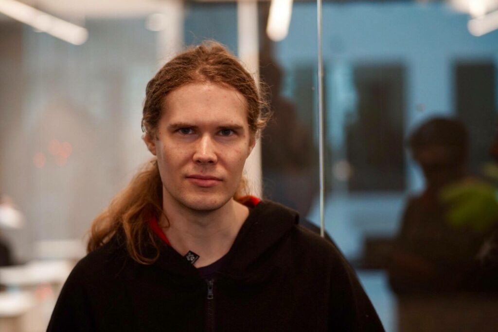
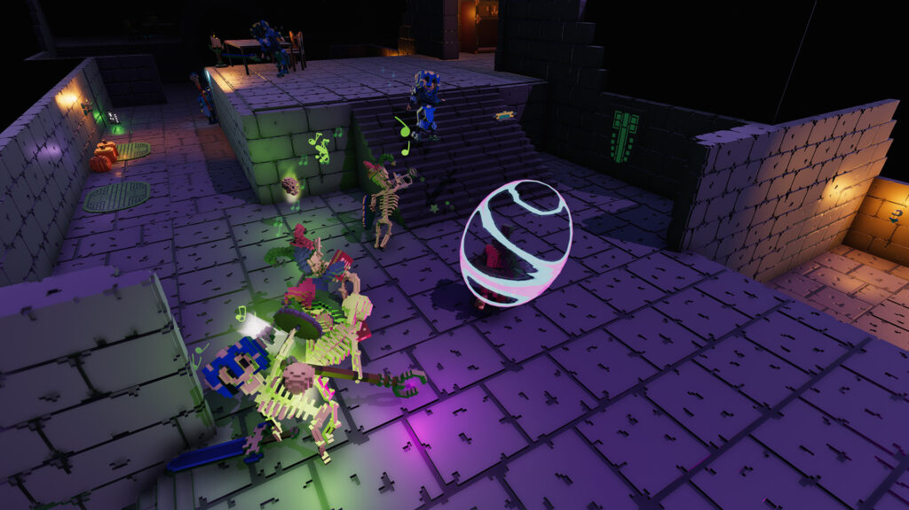
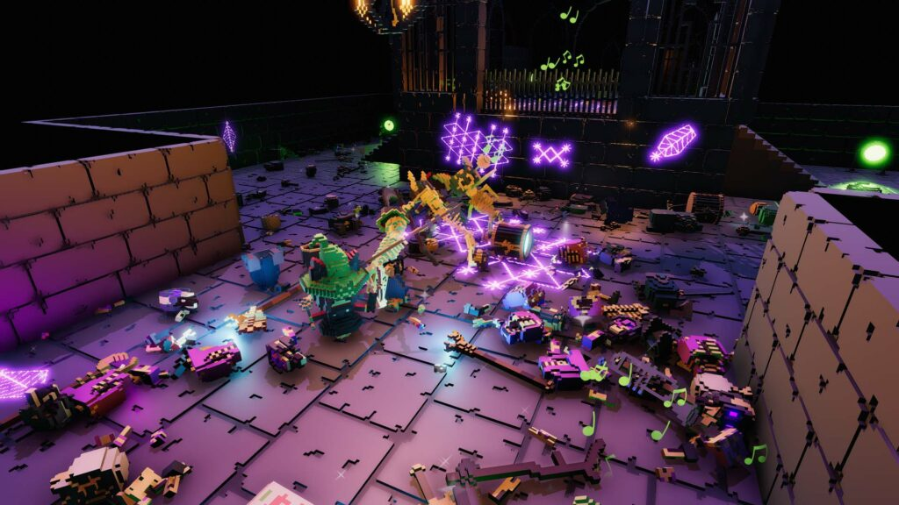
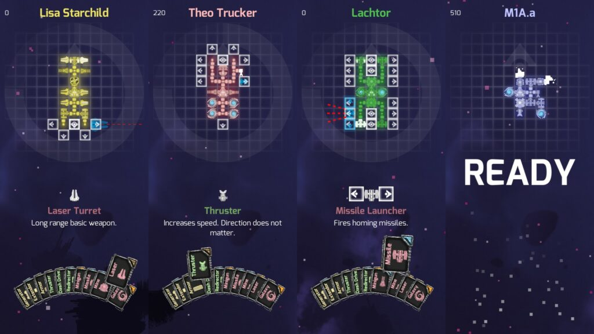
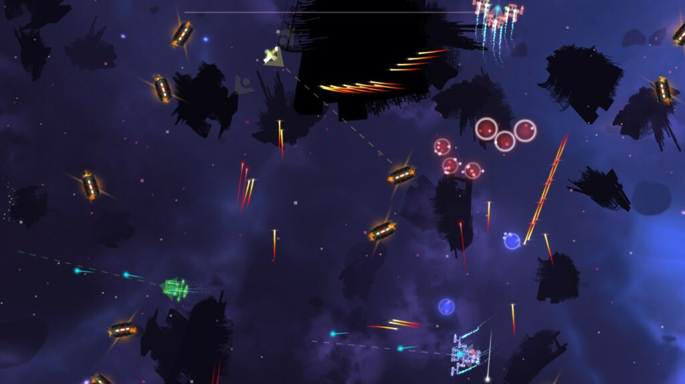
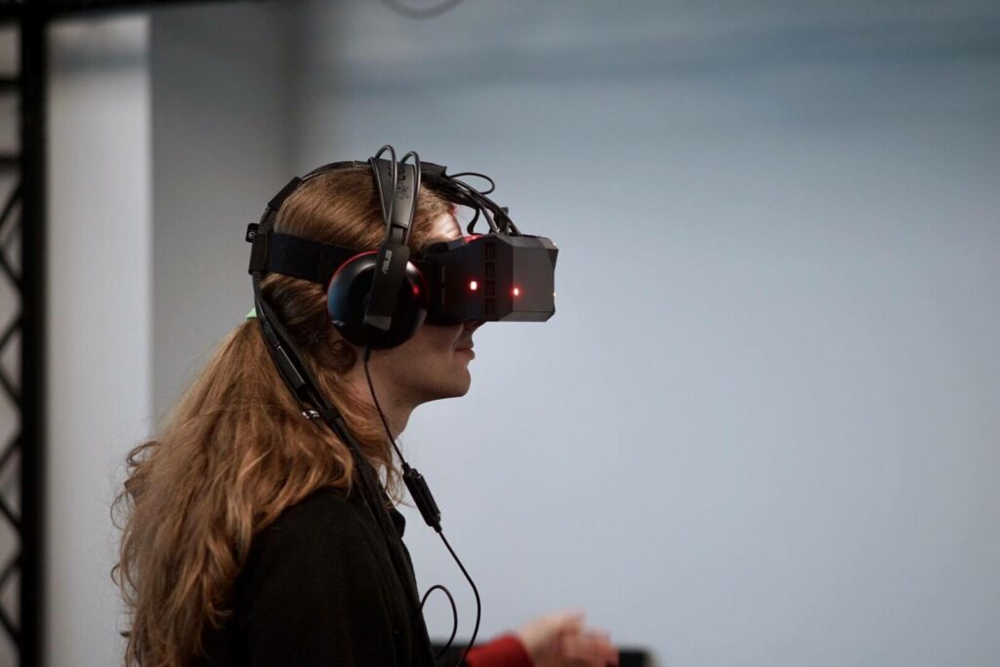

**Namn:** Jesper Tingvall  
**Program:** D  
**Examensår:** 2016

## Var jobbar du och hur ser en vanlig arbetsdag ut för dig?

Jag arbetar på konsultföretaget HiQ. HiQ pysslar med det mesta som rör teknik fast jag har specialiserat mig på spelteknik och spelmotorer. Om folk frågar vad jag arbetar med brukar jag säga att jag använder spelteknik för saker som inte är spel. Företag jag har arbetat för inkluderar Scania, Toyota och Siemens. Uppdrag kan vara allt ifrån AR, VR till simulatorer och visualisering.

Vid sidan av HiQ driver jag min egna spelstudio [Catalope Games](http://catalope.co/). Målet med Catalope Games är att bygga små unika spel som ingen egentligen har tänkt på innan. Jag har släppt 2 kommersiella via Catalope Games Det första spelet var [Scrap Galaxy](https://store.steampowered.com/app/723110/Scrap_Galaxy/), ett partyspel om att bygga rymdskepp. Det andra och senaste är [Skeletal Dance Party](https://store.steampowered.com/app/599160/Skeletal_Dance_Party/), ett fysikbaserat rollspel om en häxa som har ett dansparty för sina skelett. Just nu arbetar jag på 2 till spel, pusselspelet [Mark of Mona](https://gamejolt.com/games/markofmona/444850) och ett än så länge hemligt projekt.

<!--more-->

Under den senaste tiden har jag arbetat hemifrån på grund av Corona. Annars brukar jag kunna mixa att arbeta på plats och arbeta hemifrån. En vanlig arbetsdag brukar inledas med att kolla emails på morgonen och därefter ett 15 minuters standup möte. Resten av dagen konsumeras ofantliga koppar te och skrivs ordentligt med C# kod. På kvällarna och helgerna brukar jag arbeta på Catalope Games projekt.

<figure>

- 
    
- 
    

<figcaption>

_Skeletal Dance Party_

</figcaption>

</figure>

<figure>

- 
    
- 
    

<figcaption>

_Scrap Galaxy_

</figcaption>

</figure>

## Varför valde du att jobba med det?

Jag gillar omväxling och flexibilitet därför blev det rätt självklart att arbeta på ett konsultföretag. Spelutveckling är mitt stora intresse så därför var teknikvalet enkelt med.

## Bästa minnet från studietiden?

De bästa minnena ifrån studietiden skapades av att alla ens kompisar bodde så därmed var det riktigt enkelt att umgås och festa tillsammans.

## Var du sektionsaktiv, eller på annat sätt aktiv i studentlivet? I så fall hur var det?

Jag var med i ett flertal studentföreningar, bland annat Mahjongföreningen Lirma och Holgerspexet. Jag är fortfarande delvis aktiv i programmeringsföreningen LiTHe kod där jag är en del i gruppen som arrangerar [LiU Game Jam](http://liugamejam.se/).

## Vilken var din favoritkurs under studietiden?

Det är riktigt svårt att välja en favoritkurs fast några av de jag gjorde mest roliga projekt i är Digital Konstruktion (TSEA43) och Design och programmering av datorspel (TDDD23). När jag tänker tillbaka på alla kurserna jag läst så har nästan haft nytta av något ifrån alla under min arbetstid.

## Tips till nuvarande studenter eller övrig hälsning?

Se till att engagera dig i studentföreningar som intresserad dig och se till att göra klart exjobbet!

* * *

Ni hittar hela Alumni-bloggen med alla porträtt [här](https://d-sektionen.se/kategori/alumni-blogg/)!
