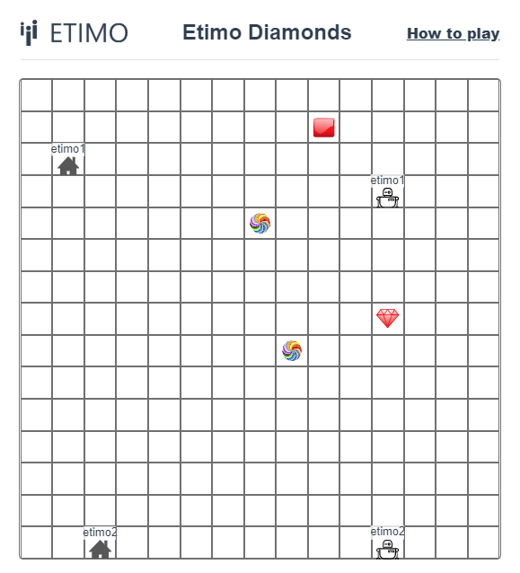

#### TÄVLINGEN ÄR IGÅNG!

**Koda bäst bot, vinn dator / tillbehör för 6 000 kr**

Etimo ordnar åter den årliga programmeringstävlingen för Linköpings studenter. Tävlingen går ut på att koda den bästa boten; den person vars bot plockar flest diamanter på 1 minut vinner. Spelplanen är ett rutbräde. Vinnaren (den person som toppar high score listan per 2020-05-17 kl 24.00) vinner ett presentkort på 6 000 kr för dator- och datortillbehör. Andrapris är ett presentkort på 3 000 kr och tredjepris är 1 000 kr.

Gå in på [diamonds.etimo.se](http://diamonds.etimo.se/) och klicka på "How to play" för att komma igång och delta i tävlingen! Tävlingen öppnar 6e maj kl 12.00 och avslutas den 17e maj kl 24.00.

Frågor eller funderingar - skriv till [kontakt@etimo.se](mailto:kontakt@etimo.se) med rubriken "LIU Diamondstävling"
