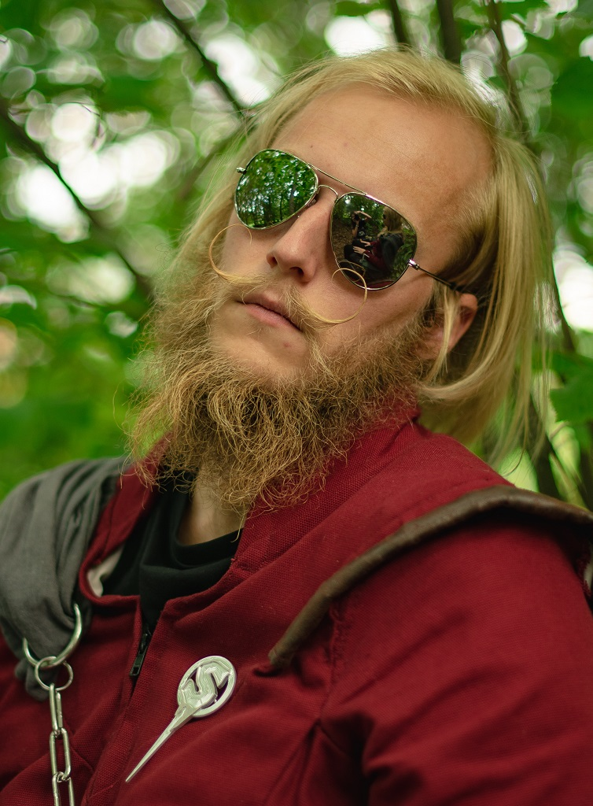

Här kommer ännu en härlig intervju med en av sektionens alla sektionsaktiva. Denna gång får ni träffa Erik Grundberg som har varit nollegruppsansvarig i STABEN 19/20!

<figure>

<figcaption>

Foto: Cecilia Olsson

</figcaption>

</figure>

## **(Han) Solo**

* * *

## Vem är du?

Jag heter Erik Grundberg, kallas Grunk. Jag har en ynka timme kvar (framläggning av examensarbete) på Datavetenskapsprogrammet, så jag tar examen om ett par veckor faktiskt. Under året som gått har jag varit nollegruppsansvarig i STABEN.

## Vad är din post i STABEN och vad innebär den?

Jag var nollegruppsansvarig och det innebär att man ansvarar för nollan och framförallt delar in nollan i nollegrupper. Den största utmaningen med posten är att få en bra matchning mellan alla nollan så att de får kompisar i gruppen och har ett kul nolle-P.

<!--more-->

## Hur är livet som nollegruppsansvarig och hur har det varit?

Kanske lite mer STABEN som helhet som jag har fått uppleva, just nollegruppsansvarig är inte så speciellt. Dels var det mycket planering, vi började i Januari med planeringen. Sen skulle vi sy stass, skriva gyckel, etc, och allt skulle vara klart innan DÖMD, så man har en hel del att göra de första månaderna. Sen kommer sommaren som är lite lugnare om man har planerat bra under våren. Till sist kommer nolle-P med allt som det innebär. Mycket konstiga saker som händer både med och utan nollan de veckorna. 

## Vad har varit roligast med att vara med i STABEN? 

Det roligaste har nog varit alla de konstiga saker man fick uppleva som man aldrig hade fått uppleva annars. Dels bara att gå i karaktär och flamsa, det är inte mycket som slår det på universitetet. Men specifikt att äta solkräm eller få potatisgratäng i hela ansiktet, det är två grejer som sticker ut.

## Hur gott är det med solkräm?

Det var ju kul, men jag kanske inte brukar äta solkräm. Men med några mariekex och solkräm får man en skön burgare som man kan skrämma nollan med. Jag fick lite konstiga blickar bara och ett sorl av _uueeghh_ genom publiken.

## Hur gick känslorna när ni fick bryta masken under nolle-finalen?

Jag ska inte säga att det var en lättnad men det var som att någonting släppte. Det har ändå varit lite jobbigt att hålla masken. Exempelvis så kan man inte gå normalt, man kan inte cykla till skolan utan vi fick åka bil, man fick åka och hämta varandra. Det var ett väldigt projekt att bara hålla sig hemlig, typ åka och handla försökte vi undvika. Man fick göra sina ärenden innan solen gick upp och efter solen gick ner ungefär för att inte bli sedd av nollan. För man ser ju lite märklig ut även i vanliga kläder, med skägg och ovårdat hår.

Sen var det väldigt kul att få träffa alla för vi har egentligen bara sett nollan genom våra solglasögon. Därför var det väldigt kul att få prata med alla och höra vad de har tyckt. Det var ju många som tyckte att det hade varit två väldigt roliga veckor hade de haft. Det är ju jättekul att få höra att det vi har gjort under året var uppskattat, och att man gjort det som nollan kanske kommer tycka var det roligaste under hela studietiden. Åt andra hållet blir det ju också väldigt roligt då nollan till slut får se oss för vilka vi egentligen är, visst att vi är konstiga till vardags också, men vi är inte SÅ konstiga. 

## _Team Time_

* * *

## Kan du med egna ord förklara vad STABEN gör?

STABEN gör nolle-p, …, fast det är lite dumt formulerat för utan faddrar och nollan skulle det inte bli så mycket nolle-p. Men lite kortfattat kan man väl säga att STABEN planerar och förbereder inför nolle-p. Sen gås det ju på fester, skriver gyckel, syr en stass. Det är väl typ det som STABEN gör.

## Hur mycket tid lade ni på att sy stassen?

Vi hade ju något schema och jag tror jag landade på 130 timmar i systugan.

## Hur känns det att nu ha fått en STUBBEN / lill-STABEN?

Det känns kul. När vi gick igenom allt material på internet och lite så så känns det som att jag blev klar med det jag hade gjort och att _\*beep\*_ nu ska få bygga vidare på det och göra det ännu bättre kändes lite skönt. Det har varit ett stort ansvar och att få lämna över det ansvaret är en liten lättnad ändå.

## Tog det lång tid innan ni kom fram till att köra på Game of Thrones-temat?

Nej, det var första mötet som det blev framröstat. Det var många som hade funderat på GoT innan eftersom sista säsongen kom så lägligt. Det låg väldigt bra i tiden för oss, det hade inte gjorts tidigare och eftersom det nu var sista säsongen skulle det vara lite sista chansen. 

## Var du nöjd med säsongsavslutningen av GoT?

Jag har faktiskt bara sett säsong 1, så jag ska inte uttala mig om det.

## Vem var ganska kass på att hålla masken under nolle-P?

Jag skrattade ganska mycket under nolle-p, jag började skratta redan första dagen vi träffade nollan när vi satt i dungen och delade ut uppdragen. Det var bara några få som såg det men jag fick ändå lite kritik för att jag var dålig på att hålla masken. 

## _Om alla D-sektionens utskott hade_ c_apsat i samma cirkel_

* * *

## Vem träffar hjälten?

Utvalda delar av STABEN skulle träffa frivilligt bara för att det innehåller alkohol. Så STABEN tar nog den ändå, frivilligt.

## Vem träffar sin egen kopp?

Det skulle nog va lill-STABEN eftersom de inte riktigt lärt sig hur saker fungerar här på universitetet.

## Vem missbrukar mest alkohol? _(Redaktören påpekar: "missbruka alkohol" = råka hälla ut dryck)_

STABEN där också faktiskt. 

## Vem verkar nyktrast när ni slutar?

Det skulle nog kunna vara DEG! Jag tror på dem!

## SnabbaCa$h

* * *

## Kommer solskenet före eller efter regnet?

Före.

## Nolle-P som nollan eller nolle-P som STABEN?

Som nollan är nog roligare tror jag

## Favoritgodis?

Allt lösgodis, utom lakrits!

* * *
