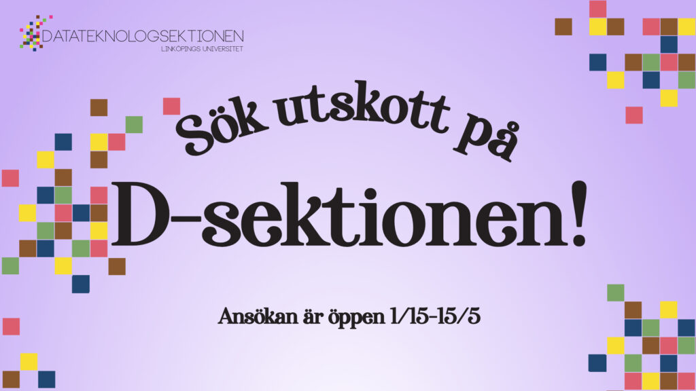

Slutet på läsåret närmar sig med stormsteg, och med det börjar planeringen inför nästa år för många av våra utskott! Till det behövs engagerade studenter som skulle vilja bli sektionsaktiva och på så vis hjälpa våra vår sektion och våra utskott att utvecklas och göra studentlivet roligt för alla våra medlemmar!

Därför öppnar ansökan nu till flera av våra utskott. Styrelsen fortsätter även att leta efter kandidater att tillsätta de poster som lämnades vakanta efter vårmötet, läs mer om det längst ner i beskrivningen.

Sista ansökningsdag är den 15:e maj.

<!--more-->

## Aktivitetsutskottet

### Aktivitetsgruppen (AktU), ordförande

AktU är gruppen som ansvarar för att hålla i roliga aktiviteter som innebandy-, fotboll-, och brädspelskvällar, och även några större evenemang som fulsittningar.

Vill du vara ordförande för AktU? Vi söker just nu dig som är strukturerad, tycker om att leda, och kan inspirera resten av AktU. Som ordförande kommer du vara ledaren för Aktivitetsgruppen och behöver se till att arbetet blir planerat och genomfört. Så om du är intresserad av att leda det mest aktiverade utskottet på sektionen, sök!

För frågor kan du kontakta Erik Halvarsson på [erik.halvarsson@d-sektionen.se](mailto:erik.halvarsson@d-sektionen.se)

[Ansökningsformulär](https://docs.google.com/forms/d/e/1FAIpQLSdi8Rwn49hjYzK_a0nOm1wqq--zKVNfavscVitZtKd0gmm6AA/viewform)

### D-LAN, projektledare

Vill du vara projektledare för D-LAN? Vi söker nån som är strukturerad, har erfarenhet att leda, som kan inspirera resten gruppen, och så klart älskar LAN!

Så är du intresserad av att ta en ledande roll i att anordna LiU:s största LAN, sök!

För frågor kan du kontakta Erik Halvarsson på [erik.halvarsson@d-sektionen.se](mailto:erik.halvarsson@d-sektionen.se)

[Ansökningsformulär](https://docs.google.com/forms/d/e/1FAIpQLSdegB9u24QwobD_JHFoZbL8RGfHQHFthG3phP-FiF6CFLSaEg/viewform)

## Festkommittén

D-sektionen fyller hela 45 år gammal 2021 och detta är självklart någonting som skall firas! Hur vi ska fira detta, ja det kan du bli en del av att bestämma!

Vill du slänga upp ett gigantiskt monument i märkesbacken? Hålla en fet sittning? Arra en riktigt nice fest? Eller hitta på något helt nytt spektakel sektionen aldrig tidigare skådat? Ta då chansen och sök Festkommittén!

Festkommittén kommer bestå av ca 6 personer med olika ansvar såsom:  
\- Vice/kassör  
\- PR  
\- Spons  
\- Tryck  
\- Sittning

Om ni har frågor kan ni mejla [festgeneral@d-sektionen.se](mailto:festgeneral@d-sektionen.se)

[Ansökningsformulär](https://docs.google.com/forms/d/e/1FAIpQLSfYTfl9JTsE8fAysSnJuFeFzRC_IH4hHu55so4rBOKfc_r-6g/viewform)

## Marknadsföringsutskottet

Marknadsföringsutskottet har öppnat ansökan 3 av posterna och nedan finner ni postbeskrivningen.

Notera att om ni är intresserade av flera poster finns det möjlighet att klicka i mer än ett alternativ!

**Vad är D-TOUR?**  
D-TOUR är ett tvådagars-event under vårterminen där Datateknologsektionen genom MafU, bjuder in gymnasieelever till campus för att ge dem en rättvis bild av studentlivet, sektionen och universitetet. Gymnasieeleverna kommer helt enkelt att få uppleva livet som student. Bland annat kommer de att få information om sektionen och våra program, gå på campusvandring, inspirationsföreläsningar, sittningar och massa annat kul! TAGGA D-TOUR 2021!

### POSTBESKRIVNINGAR

**D-TOUR: Boende och logistik  
**Som boende & logistik bokar man framförallt boende för gymnasieeleverna under D-tour, men även salar, bil och annan transport för att underlätta dagarna här på campus. Dessutom ansvarar man för maten under D-TOUR förutom när det kommer till sittningen. Är du personen som alltid fixar rum och fika till tentaplugget, vill du fixa lyxhotell till gymnasieelever, eller vet du om det bästa matstället på campus? Då är boende & logistik något för dig!

**D-TOUR: Projektledare  
**Som projektledare har du övergripande koll under D-TOUR, du är med och planerar och utformar D-TOUR 2021 tillsammans med en projektgrupp under hösten, allt ifrån boende till sittningar och föreläsningar. När D-TOUR närmar sig kommer mindre undergrupper skapas (matgrupp, bilgrupp, tävlingsgrupp osv) som du kommer att leda. Har du många bra ideér och vill arrangera ett väldigt roligt event? Då är projektledare något för dig!

**Kassör**  
Som kassör ansvarar du för att MafU håller budgeten (och inte spenderar för mycket hehe). Utöver håller du koll på kvitton och skickar dessa till sektionskassören. Är du strukturerad, tycker ekonomi är intressant och gillar hantera pengar så är kassör en post som passar dig!

Vid eventuella frågor, hör av dig till Marknadsföringsansvarig  
Malin Widén, [malin.widen@d-sektionen.se](mailto:malin.widen@d-sektionen.se)  
eller  
19/20 Marknadsföringsansvarig Rosanna  
[rosis787@student.liu.se](mailto:rosis787@student.liu.se)

[Ansökningsformulär](https://docs.google.com/forms/d/1qNfeyhcnh0dkvp2OEb3lijme4kPudHnSstm65Ip39qI/viewform)

## Näringslivsutskottet

D-sektionens näringslivsutskott, NärU, är ett utskott vars fokus ligger på att agera som länk mellan näringslivet och sektionen.

Detta genomförs praktiskt genom bland annat:  
\-Företagskvällar  
\-Annonsering  
\-Lunchföreläsningar

NärU söker nu 1-2 medlemmar som kommer vara verksamma läsåret 20/21. Dessa personer kommer vara med och driva NärU samt assistera vid höstens ansökningsperiod.

Vid frågor, kontakta näringslivsansvarig:  
Oliver Börjesson  
[oliver.naru@d-sektionen.se](mailto:oliver.naru@d-sektionen.se)

[Ansökningsformulär](https://docs.google.com/forms/d/e/1FAIpQLSdjr9YxsddSQ88-Lfhjx-SS8kl-yCl3mYLaPse8rWbYOxn-kA/viewform)

## Werkmästeriet

Känner du att datorer och programmering är jättekul, men att det kan bli lite jobbigt att sitta still hela dagarna? Känner du att det blir för abstrakt att plugga om ettor och nollor och pekare du inte ens kan se, och känner att du vill jobba mer fysiskt? Har du biceps som Arnold Schwarzenegger?

Sök D-sektionens mest fysiska utskott! Werkmästeriet är det utskott som ansvarar för sektionens materiella tillgångar, till exempel sektionsbilen, sektionsrummen och förråden.

Just nu söker Werkmästeriet en VägWerk och en KraftWerk för att påbörja arbetet inför nästa år:

VägWerk - har hand om sektionens käraste ägodel, Kianu Revs, aka bilen. Allt från bokning, byta av däck till tankning. Beroende på hur bra folk kör med den kan det också bli ett och annat besök till verkstaden.

KraftWerk - har hand om sektionens förråd: A15 (snart B25), VTI och Pappers. I stora drag handlar posten om att se till att förråden är så pass rena att det går att hitta saker samt att golvbokningen i A15 följs.

Michelle Krejci  
[michelle.krejci@d-sektionen.se](mailto:michelle.krejci@d-sektionen.se)

[Ansökningsformulär](https://docs.google.com/forms/d/e/1FAIpQLSebgJrISernH96WG35qqegyOPq7dpcaYgi821PmJlLpEvHQ_A/viewform)

## Vakanta poster från vårmötet

Som många säkerligen vet blev ett antal förtroendeposter vakantsatta under sektionens vårmöte den 26:e april. De poster som vakantsattes var:

- Studienämndsordförande D
- Studienämndsordförande U
- Studienämndsordförande IP
- Studienämndsordförande masternivå
- Infochef
- Webmaster
- Revisorer
- Alumniutskottets ordförande
- Utbildningsutskottets ordförande

Styrelsen kommer under resterande av vårterminen försöka tillsätta personer till dessa poster. Är du nyfiken på att höra mer? Kontakta mer än gärna styrelsen om detta - [ordforande@d-sektionen.se](mailto:ordforande@d-sektionen.se)
