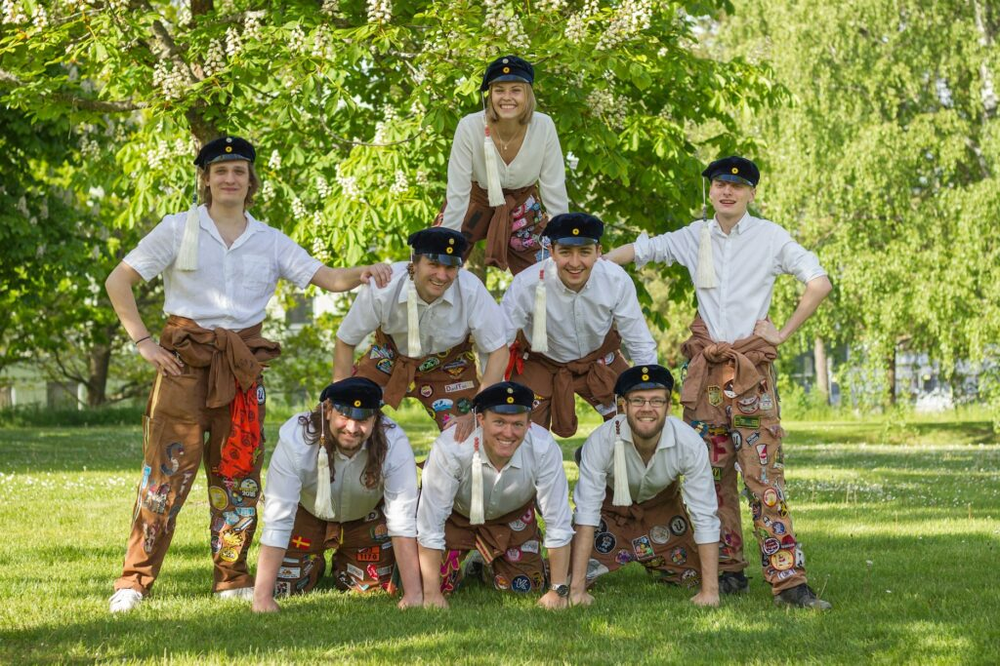

<figure>

<figcaption>

_Datateknologsektionens [Styrelse](https://d-sektionen.se/styrelsenkansli/) 20/21_

</figcaption>

</figure>

Varmt välkommen till studentlivet, och särskilt grattis till en plats vid en av utbildningarna som **Datateknologsektionen** representerar!

I år är det ett speciellt år – men misströsta inte: Hela campus är vigt åt er nya studenter! Mottagningsperioden kommer att bli en upplevelse ni aldrig glömmer, med vänner för livet. Se därför till att ta del av all viktig information från STABEN på [**STABEN.info**](https://staben.info) så att ni inte missar något!

Utöver STABENs information hittar ni information kring upprop m.m. för varje utbildning på [**LiU:s webbsida för dig som blivit antagen**](https://liu.se/utbildning/antagen). Vi har även sammanställt lite matnyttig information på sidan [**Ny student**](https://d-sektionen.se/sokande/).

Vi tipsar även om att gå med i våra Facebook grupper **[D-sektionen](https://www.facebook.com/groups/detbasta/)** och **[D-sektionens köp och sälj](https://www.facebook.com/groups/dsaljer/)** så håller ni er uppdaterade om allt som händer, och kan köpa billig kurslitteratur! Gilla även **[vår Facebook-sida](https://www.facebook.com/datateknologsektionen/)** för att få ännu bättre koll!

<figure>

https://www.youtube.com/watch?v=zww3wxCL8rQ

<figcaption>

_Information om mottagningen från **[LinTek](https://lintek.liu.se)** och studenthälsan på LiU._

</figcaption>

</figure>

Vi ser fram emot att träffa er såväl under mottagningen som efter mottagningen då ni får möjlighet att själva engagera er i sektionen!

Varmt välkomna till Linköping, så ses vi framöver!

/ _D-styret 20/21_
