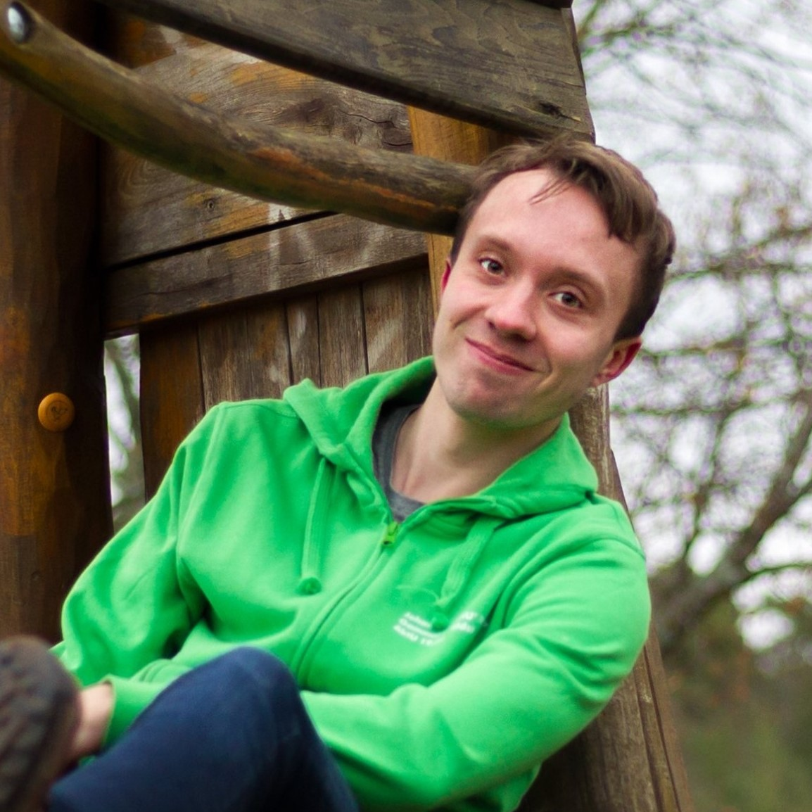
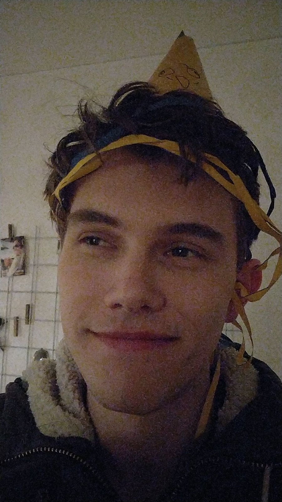
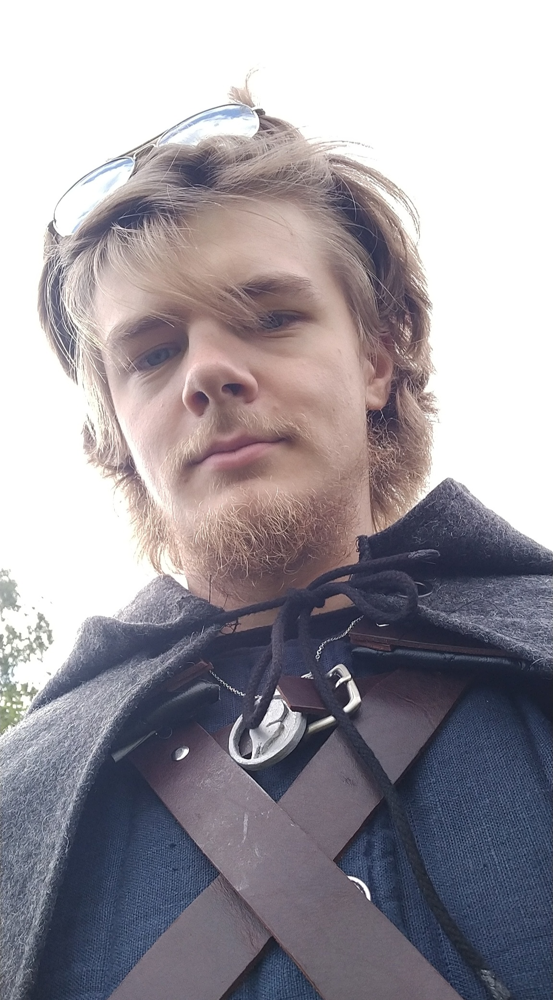
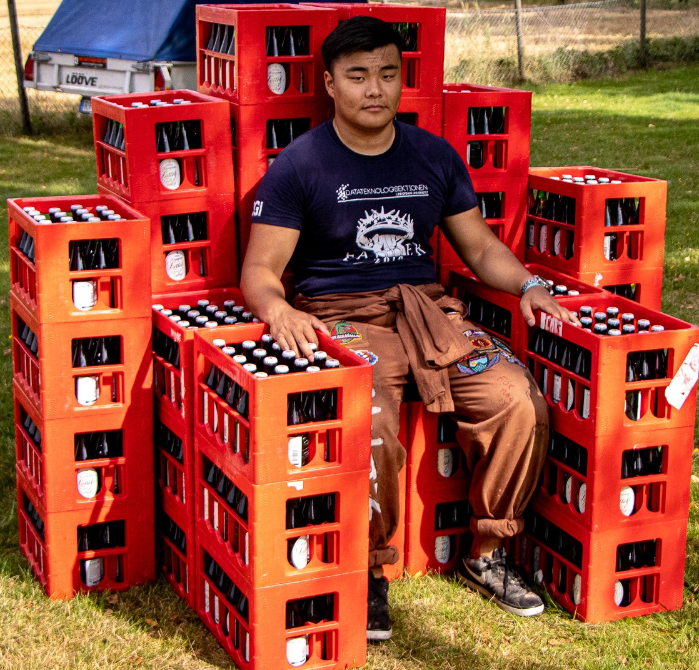
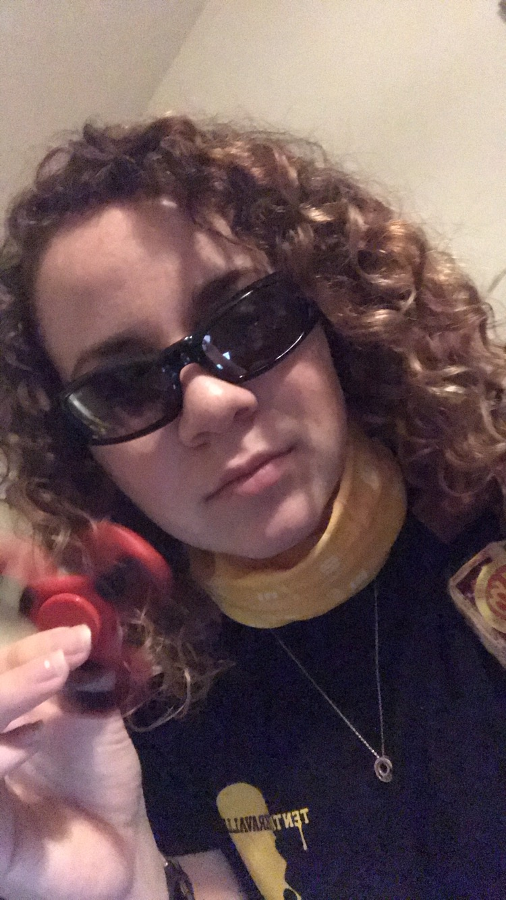

<!---->

Rerkryteringsperioden hösten 2020 är i full gång, men börjar närma sig sitt slut. Om du fortfarande är lite osäker på om något av utskotten är för dig så vill vi hjälpa dig på traven. Här kommer korta intervjuer av alla utskottsordföranden för att lära känna dem och deras utskott lite bättre!

Perioden att söka slutar nu på söndag den 20 september kl 23:59. Tills dess går det utmärkt att ansöka till alla de utskott som rekryterar. Mer info om rekryteringen och ansökan går att hitta på [https://d-sektionen.se/ansok/](https://d-sektionen.se/ansok/). In och sök vettja!

<!--more-->

---

## Presentation Webbgruppen

### **OBS! Detta är en intervju med förra årets webmaster!**

**Hej! Vem är det jag pratar med?**

Hej! Jag heter Emil och pluggar tredje året på mjukvaruteknik. Jag är webmaster i D-sektionen under läsåret 19/20.

**Vad gör ditt utskott?**
Vår uppgift är att utveckla och underhålla sektionens hemsidor. Detta innebär att vi gör allt från att underhålla sektionens virtuella Linux server, till att utveckla våra hemsidors design. Exempel på vad vi skapat de senaste åren är ett röstningssystem, ett bilbokningssystem, ett infomailsystem, ett blippsystem, med mera.

**Varför ska man söka till ditt utskott?**
Om man gillar webbutveckling och vill lära sig mer om det är webbgruppen en bra möjlighet att få prova på att arbeta tillsammans med andra i ett projekt eller få chansen att hitta på något eget man vill bidra med. Sen blir man såklart sektionsaktiv och på det viset får man lära känna många nya människor.

**Vilka egenskaper tror du är bra att ha i ditt utskott?**
Huvudsaken är att man har en vilja att hjälpa till och en vilja att lära sig mer. Det hjälper såklart också att ha tidigare erfarenhet och vara en duktig webbutvecklare/programmerare, men det är absolut inget krav.

**Hur mycket arbete skulle du säga att det innebär att vara med i utskottet?**
Det huvudsakliga arbetet kommer ske på våra kodkvällar där vi en kväll i veckan under terminstid träffas, diskuterar hur arbetet går och jobbar vidare med våra projekt.

**Något övrigt du vill tillägga?**
Nej.

#### **OBS! Detta är en intervju med förra årets webmaster!**

---

## Presentation Infogruppen

### **OBS! Detta är en intervju med förra årets infochef!**

**Hej! Vem är det jag pratar med?**

Hej! Johan heter jag och är sektionens Infochef, vilket innebär att jag ansvarar för innehållet på sektionens hemsida, det vill säga denna sida, samt våra sociala kanaler! Det innebär även att jag är ordförande i Infogruppen.

**Vad gör ditt utskott?**
I Infogruppen framställer vi och hanterar en massa material som ska användas som marknadsföring på hemsidan och i sociala medier. Det som är helt spikat kommer ske är att ta fram en julkalender på hemsidan tillsammans med olika utskott och samarbetspartners, utföra sektionsfotografering någon gång under läsåret, samt skicka ut infomail till sektionsmedlemmarna varje vecka om allt spännande som pågår.

Utöver detta är dörren öppen för att ta sig an nya projekt och idéer som inte tidigare gjorts, det är upp till oss i gruppen!

**Varför ska man söka till ditt utskott?**
Det finns så många olika anledningar. För att man tycker det låter kul att göra PR och/eller hitta på roliga saker för att locka människor att komma på evenemang som sektionen anordnar. För att man vill bli sektionsaktiv och få möjlighet att göra en massa roliga saker under året och träffa nya människor. För att du också blir lite smått beroende av kicken när likes:en rullar in.

**Vilka egenskaper tror du är bra att ha i ditt utskott?**
Det är bra om man är kreativ och har många idéer, det vore jättekul att kunna hitta på lite nya saker som inte tidigare gjorts! Under året kommer det skrivas en hel del texter på hemsidan, Facebook och Instagram, samt tas en del bilder, så om du gillar att skriva eller fotografera (vi behöver t.ex. någon som kan ansvara för att bilderna till sektionsfotograferingen blir bra) är det också uppskattat.

Det skall dock noteras att det finns inga som helst krav på några specifika kunskaper för att få vara med i Infogruppen, det viktigaste är en vilja att hjälpa till och att lära sig mer!

**Hur mycket arbete skulle du säga att det innebär att vara med i utskottet?**
Under året kommer vi ha ett par lunchmöten där det är bra om man kan vara med, samt sektionsfotograferingen där det är viktigt att så många som möjligt kan hjälpa till.

I övrigt är det hela väldigt flexibelt; det går egentligen att lägga så mycket eller så lite tid man vill. Vi hoppas så klart att alla som är med tycker det är kul på så vis att man vill lägga ner tid på det, men generellt så lägger man ner den tid som man känner att man vill och klarar av.

**Något övrigt du vill tillägga?**
Om man har frågor kring Infogruppen så går det jättebra att skicka dem till [info@d-sektionen.se](mailto:info@d-sektionen.se), så svarar jag så fort jag kan. Och SÖK, det blir kul!

#### **OBS! Detta är en intervju med förra årets infochef!**

---

## Presentation Alumniutskottet

### **OBS! Detta är en intervju med förra årets ordförande för alumniutskottet!**

**Hej! Vem är det jag pratar med?**

Tja, jag heter Robin och är ordförande för Alumniutskottet (xD). Jag är 21 år och pluggar andra året Mjukvaruteknik.

**Vad gör ditt utskott?**
Alumniutskottet är till för att D-sektionens alumner (före detta studenter på D-sektionen aka xD:are) och studenter ska kunna få kontakt med varandra. Som student kan det vara kul att få reda på vad man kan göra efter sin utbildning och hur det var förr, då de som många säger var bättre. Det kan antingen göras med lite käk på en lunchföreläsning eller över några öl på en alumnipub. Vi arrangerar även Generationssittningen som är en sittning för förtroendevalda nuvarande och från förr (och alumniutskottet själv). Man kan till och med följa med en alumn under en arbetsdag om man vill uppleva saker själv. Men även om man inte vill lämna sin käraste dator så kan man ju alltid bara titta på alumni-bloggen som finns på d-sektionens hemsida.

**Varför ska man söka till ditt utskott?**
I alumniutskottet (xD) får du vara med och arrangera väldigt varierande evenemang, träffa och snacka med massor av sköna alumner och gött häng. 

Det är inte helt fel att jobba för utskottet när man tar en bira på alumnipuben eller ett glas vin på Generationssittningen.

**Vilka egenskaper tror du är bra att ha i ditt utskott?**
Det är ingen post i alumniutskottet som kräver någon större tidigare erfarenhet. Om du är engagerad, kan skriva mail och är villig att hänga med alumner över en bira så kommer du passa finfint.

**Hur mycket arbete skulle du säga att det innebär att vara med i utskottet?**
Ett lunchmöte i veckan, lite prepp inför lunchföreläsningar och pubar, och en dag för att arra och gå på Generationssittningen.

**Något övrigt du vill tillägga?**
Kom igen det blir kul!

#### **OBS! Detta är en intervju med förra årets ordförande för alumniutskottet!**

---

## Presentation Werkmästeriet

**Hej! Vem är det jag pratar med?**

Tjo! Michelle heter jag och är ordförande för Werkmästeriet. Jag är 21 år gammal och pluggar mitt tredje år på Datateknik. Förutom att gå runt i Configura och fråga "Varför ligger det här här?" brukar jag planera mitt liv i excel och lägga för många timmar på Elder Scrolls Online.

**Vad gör ditt utskott?**
Werkmästeriet är det utskott som ser till att saker som förväntas funka faktiskt funkar. Vi ansvarar för alla förråd, sektionsrum och tillgångar och ser till så att sådant som sektionens medlemmar vill ha finns till förfogande. Det betyder att man gör allt ifrån att köpa kaffe till sektionsrummet Netlight till att se till så att sektionens bil är hel och körduglig.

**Varför ska man söka till ditt utskott?**
Om man är less på att sitta ihopkrupen framför datorskärmen hela dagarna, vill få utlopp för sin inre Mulle Meck eller gillar att arbeta "behind the scenes" är det Werk rätt utskott. Det kan också vara så att man är lite förtjust i Biltema.

**Vilka egenskaper tror du är bra att ha i ditt utskott?**
Tålmodig och flexibel. Eftersom det mesta jobbet består av underhåll kan det vissa gånger vara svårt att veta i förväg när till exempel något på bilen, servern, förråden eller sektionsrummen behöver åtgärdas.

**Hur mycket arbete skulle du säga att det innebär att vara med i utskottet?**
Om allt flyter på och inget går sönder så är det nästan inget att göra, men i lite mer realistiska fall så krävs det nog någon timme per vecka på de flesta posterna, framförallt för ReningsWerk.

**Något övrigt du vill tillägga?**
Det werkar som att jag fått med allt.

---

## Presentation Näringslivsutskottet

**Hej! Vem är det jag pratar med?**
Mitt namn är Oliver Börjesson och jag är näringslivsansvarig för verksamhetsåret 20/21. Jag pluggar mitt andra år på civilingenjör inom informationsteknologi. Jag kommer ursprungligen från Skara, men är nu bosatt sedan 2 år tillbaka i Linköping. Mitt allra största intresse, bortsett från skolan och NärU, är skidåkning, vilket jag försöker göra så mycket jag kan och hinner.

**Vad gör ditt utskott?**
Näringslivsutskottet har som fokus att agera som en brygga mellan näringslivet och sektionen. Vi hjälper sektionens medlemmar att komma ut i arbetslivet och få sin första kontakt med företag redan under studietiden. Detta gör vi i form av lunchföreläsningar, kvällsevent och andra företags-relaterade event.

**Varför ska man söka till ditt utskott?**
Gillar man att knyta kontakter inom sektionen och med näringslivet är NärU helt rätt för dig. Här har du möjlighet att träffa väldigt många intressanta företag, arrangera olika sorters event och utveckla ditt affärsmannaskap.

**Vilka egenskaper tror du är bra att ha i ditt utskott?**
Jag tror att samarbetsförmåga och en nyfikenhet på näringslivet är stora fördelar att besitta om man söker NärU. Att vara taggad på att dela ut mat innan lunchföreläsningar kan också vara en bra förmåga.

**Hur mycket arbete skulle du säga att det innebär att vara med i utskottet?**
Man bör nog vara beredd på att lägga 3-4 timmar i veckan på NärU.

---

## Presentation Marknadsföringsutskottet

**Hej! Vem är det jag pratar med?**

<!---->

Jag heter Malin Widén och är Marknadsföringsansvarig. Jag är en 21-årig tjej, född och uppvuxen i Östergötland och läser U3.

**Vad gör ditt utskott?**
Marknadsföringsutskottet jobbar för att rekrytera nya studenter till Datateknologsektionens program. Vårat största event är D-Tour, men utöver det så står vi på mässor (om det blir några), har hand om hemmissionering och hittar på mindre egna event.

**Varför ska man söka till ditt utskott?**
Man ska söka MafU om man vill bidra till sektionens framtid, tycker om att prata och vill ha ett roligt år med lite lagom mycket jobb. Det är inte så mycket som är bestämt i sten vad vi ska göra under året så vi har mycket plats för nya idéer vilket är kul.

**Vilka egenskaper tror du är bra att ha i ditt utskott?**
Största delen av året skulle jag säga att det blir en till två timmar i veckan men i närheten av D-Tour och under D-Tour kommer det bli mer.

**Hur mycket arbete skulle du säga att det innebär att vara med i utskottet?**
Sök MafU! Det kommer bli ett roligt år!

---

## Presentation AktU

**Hej! Vem är det jag pratar med?**
<!---->

Hejsan, Linnéa heter jag och jag är ordförande för AktU. Jag pluggar just nu mitt tredje år på D och kommer ursprungligen från Kungsbacka på västkusten, men nu äntligen så känns Linköping mer som mitt hem! När jag inte pluggar eller lägger ner alldeles för mycket tid på ESO så gillar jag att baka och laga mat, men mest av allt så älskar jag att spendera tid med min katt Casper <3

**Vad gör ditt utskott?**
Precis som det låter så anordnar AktU massa aktiviteter och under året håller vi i alla möjliga event för alla på sektionen som t.ex. sportevent, brädspelskvällar, sittningar och Laserdome. Det som är extra kul med AktU är att man även får chansen att hålla i helt nya, never-before-seen event, så vi uppskattar all form av nytänkande och kreativitet!

**Varför ska man söka till ditt utskott?**
Om man tycker om att anordna aktiviteter, eller har massa idéer på nya aktiviteter vi kan anordna, så tycker jag man ska söka AktU! Andra anledningar till att söka kan vara för att man tycker att grönt är skönt eller att man gillar gött häng med nytt fok.

**Vilka egenskaper tror du är bra att ha i ditt utskott?**
Förutom att grönt klär en, så tycker jag att entusiasm, god samarbetsförmåga och ansvarstagande är toppen egenskaper att ha i AktU! Utöver det är det alltid härligt med en positiv attityd och att man bidrar med go energi till laget.

**Hur mycket arbete skulle du säga att det innebär att vara med i utskottet?**
Det är lite upp till var och en. Då alla i AktU har poster som ska utföras, och vi har möten varje vecka, så skulle jag uppskatta att arbetet tar några timmar i veckan. Men ibland händer det att vi fixar större event som kanske kräver lite mer arbete, tid och planering, för att få till ett riktigt fett event. I slutändan är det upp var och en hur mycket tid man vill lägga ner och vad man vill utföra.

**Något övrigt du vill tillägga?**
SÖK, det blir kul (jag kan även utlova söta bilder på Casper till alla medlemmar) :)

---

## Presentation D-LAN

**Hej! Vem är det jag pratar med?**

H3j54n! Jag heter Arvid och är projektledare för D-LAN 2021. Jag har precis påbörjat mitt fjärde år på D och är 21 år gammal. Under mina tidigare år på universitet har jag hunnit engagera mig en del i sektionen, men har nu tagit på mig ansvaret för årets roligaste event, D-LAN.

**Vad gör ditt utskott?**
D-LANs projektgrupp anordnar Östergötlands största LAN, D-LAN! Projektgruppen ansvarar för att allt ska vara redo när D-LAN går av stapeln och för att allt ska gå smidigt under LANets gång. Detta innebär en hel del olika arbetsuppgifter, allt från att boka lokaler, skriva sponsorkontrakt och gör affischer till att rigga, dra el och hålla i lunchtävlingar.

**Varför ska man söka till ditt utskott?**
Jag tycker att man ska söka D-LAN om man vill engagera sig i ett roligt projekt och vill jobba mot ett tydligt mål, att gör D-LAN 2021 så bra som möjligt. D-LAN är ett bra engagemang om man vill testa på att ha ett eget ansvarsområde, vill vara med och planera och driva event, gillar LAN, eller bara vill ha kul och träffa nya människor. D-LAN är ett evenmang med mycket utvecklingsmöjligheter och chanser för projektmedlemmarna att göra det som de tycker verkar kul. Dessutom får man som projektmedlem ett tydligt mål att jobba emot och sedan se det arbete man gjort förverkligas, vilket är en galen känsla!

**Vilka egenskaper tror du är bra att ha i ditt utskott?**
Att man är glad, positiv och taggad på att göra ett bra jobb. Det krävs inga förkunskaper för att vara med i D-LAN men det är ett plus om man har erfarenheter av sitt specifika ansvarsområde, alternativt vill lära sig massor under projektets gång! Det är bra om man gillar att jobba i grupp, diskutera och bolla idéer.

**Hur mycket arbete skulle du säga att det innebär att vara med i utskottet?**
Planeringen inför D-LAN pågår i 5 månader. Hur mycket tid man väljer att lägga på arbete beror på hur mycket utöver det som krävs man är villig att göra. Under planeringstiden kommer vi ha möte med projektgruppen en gång i veckans och någon timme utöver det kommer krävas för arbete inom ditt ansvarsområde. Arbetet blir mer intensivt ju närmare LANet vi kommer, men också roligare då man ser allt komma på plats.

**Något övrigt du vill tillägga?**
Om man har frågor är man jättevälkommen att kontakta mig via mail (projektledare@d-lan.se) eller genom att bra komma fram och prata. Annars är det enda jag har att säga: TAGGA D-LAN!!

---

## Presentation Utbildningsutskottet

**Hej! Vem är det jag pratar med?**
<!---->

Hej! Jag heter Isabell Öknegård Enavall ordförande för utbildningsutskottet och går i IT3

**Vad gör ditt utskott?**
Mitt utskott ser till så att kurserna på universitet håller en hög standard genom att exempelvis utföra kursutvärderingar. Vi är även länken mellan studenterna, LinTek och universitet och ser till så utbildningarna på sektionen håller högsta möjliga klass.

**Varför ska man söka till ditt utskott?**
För att du får vara med och påverka utbildningen som du själv läser samt. Detta är en väldigt viktig del av det arbete som sektionen gör!

**Vilka egenskaper tror du är bra att ha i ditt utskott?**
Klassrepresentanterna kommer hjälpa till att samla in utväderingar av kurserna som ni läser. Det betyder att det kan vara bra att vara ansvarsfull, noggrann och en bra lyssnare.

**Hur mycket arbete skulle du säga att det innebär att vara med i utskottet?**
Som klassrepresentant så utvärderar man de kurser man läst varje period med sin klass, detta tar ca 1h och det blir därför ungefär 2h per termin.

---

## Presentation PubU

**Hej! Vem är det jag pratar med?**

Tja! Sean Zhong heter jag och är ordförande för pubutskottet! Jag är 22 år och kommer ursprungligen från Stockholm. Jag pluggar mitt tredje år på datateknik.

**Vad gör ditt utskott?**
D-Pub är en pub dit D-Sektionens medlemmar kan komma för att äta och dricka gott samt njuta av varandras sällskap. Som medlem i pubutskottet är man med och arrangerar dessa underbara pubar. Man lagar mat i Gasquen och säljer öl/dryck till törstiga D:are i baren. Utöver att hänga i Gasquen tycker vi i PubU även om att umgås med varandra och ses gärna på en kickoff då och då, kanske lagar lite mat och knäpper en kall.

**Varför ska man söka till ditt utskott?**
Om du gillar mat, dryck och gott sällskap är detta utskottet för dig! Man får lära sig en hel del saker om hur man lagar mat och serverar många till exempel. Man skaffar sig vänner från andra årskursser och vänner för livet. Det är också väldigt kul att få vara med och anordna ett utav D-sektionens mycket uppskattade event.

**Vilka egenskaper tror du är bra att ha i ditt utskott?**
Det hjälper att ha ett matintresse och att vara stresstålig men det viktigaste är att vara driven, hjälpsam och sugen på att testa nya saker. En bra arbetsmoral och viljan att hjälpa till är en bra egenskap också! Men i slutändan handlar det om att ha en bra attityd och viljan att engagera sig och lära sig!

**Hur mycket arbete skulle du säga att det innebär att vara med i utskottet?**
Pubarna sker en gång i månaden och inför dessa behöver det planeras lite, vi har därför lunchmöte en gång i veckan med avstämning, diskussion kring vilken mat som skall serveras och uppgiftsfördelning. Dagen innan puben åker vi och handlar maten och ser till att vi har allting, sen kommer den stora dagen, då vill vi gärna att man är på plats och köttar på i gasquenköket. Så utöver själva pubdagen är det ett lunchmöte i veckan som gäller.

**Något övrigt du vill tillägga?**
Om man har några frågor kan man kontakta mig på [pubordf@d-sektionen.se](mailto:pubordf@d-sektionen.se)

_"För PubU, i tiden!"_

---

## Presentation Festkommittén

**Hej! Vem är det jag pratar med?**

Tja hej! Kimberley Andersson heter jag, pluggar mitt femte år datateknik här på D-sektionen och är Festgeneral för det kommande jubileumet

**Vad gör ditt utskott?**
Planerar, funderar och jobbar för att se till att D-sektionens 45-års jubileum blir ett event sektionen sent kommer glömma!

**Varför ska man söka till ditt utskott?**
Sök om DU är taggad på att va med och fixa D-sektionens 45-års jubileum, kbk.

**Vilka egenskaper tror du är bra att ha i ditt utskott?**
Allmänt tagg är alltid bra! Sen om man har lite tidigare erfarenheter inom sponsposten (eller liknande) är inte det helt fel men det är inget krav. Intresse och viljan att lära sig tar en ofta i mål

**Hur mycket arbete skulle du säga att det innebär att vara med i utskottet?**
Ett par timmar i veckan, största delen av arbetet kommer bli under våren då det är då själva jubileumet hålls så då kan det bli ett par fler timmar i veckan.

**Något övrigt du vill tillägga?**
Avstånd idag leder till närhet i framtiden

---

Detta var alla utskott! Hoppas ni har lärt känna några av de aktiva på sektionen lite bättre och fått lite insyn i hur det kan se ut i våra utskott! För att söka kan ni gå in på [d-sektionen.se/ansok](https://d-sektionen.se/ansok)
