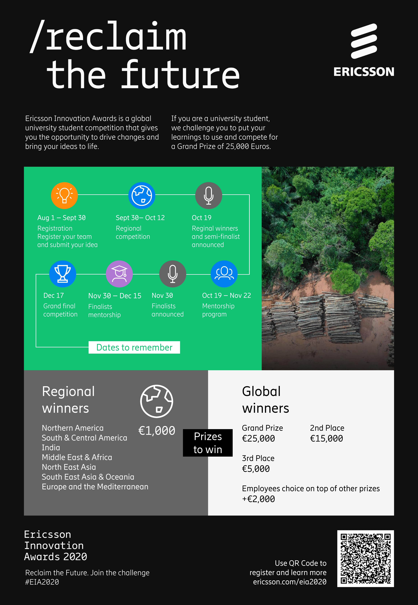
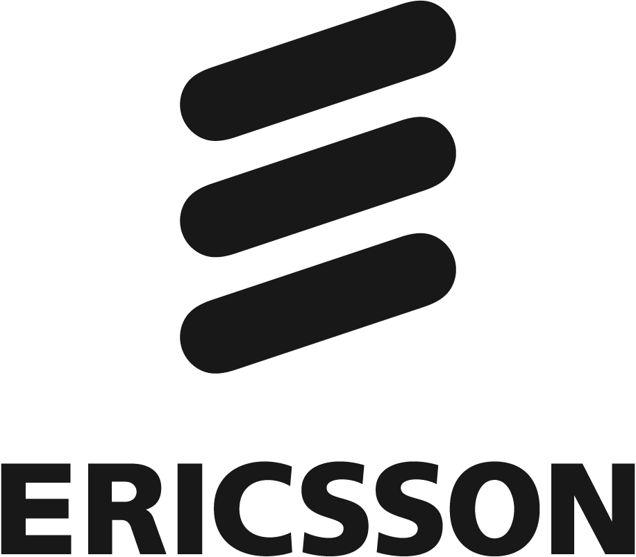

Whatever you do – Don’t miss this unbeatable combination: Save the planet and win €25,000 at the same time!!

Participate in Ericsson's annual innovation competition Ericsson Innovation Awards. All you need to do is to gather some friends, brainstorm and propose an ICT solution that can mitigate the climate change. It can be anything from an app that makes everyone go vegan to a fantastic digitally controlled machine that literally eats up the CO2 problem...as long as it is realistic and nicely described.

Submissions are open until September 30th, so do not wait until tomorrow - read more, watch the movie and register your team and your idea [here](https://www.ericsson.com/en/careers/eia?utm_source=linkedin&utm_medium=social_organic&utm_campaign=GFMC_global_careers_eia-2020_20200721)

Good luck!! We look forward to your contribution!
