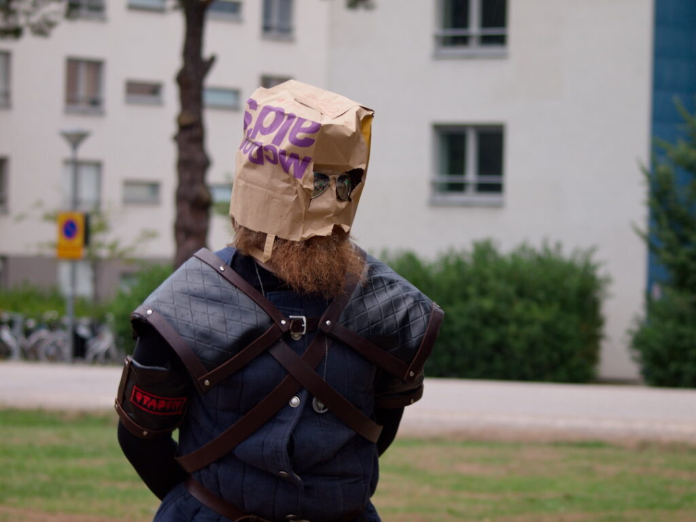
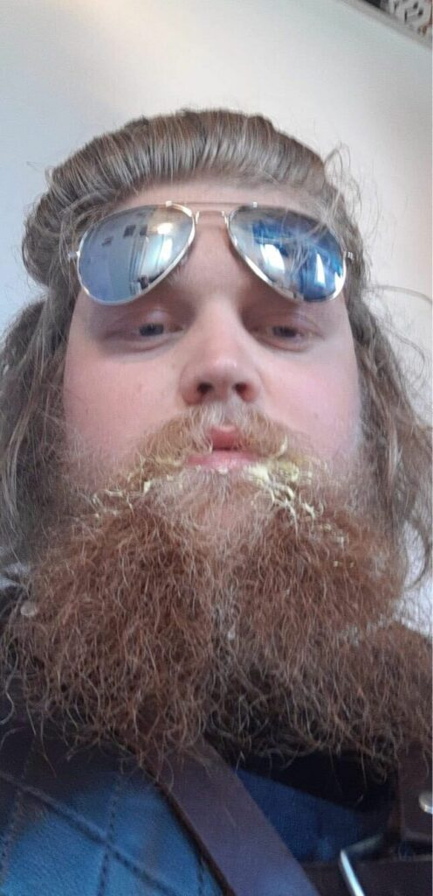

### Sök till STABENs general!

Just nu så pågår rekryteringsperioden till att bli STABENs general (även kassör söks) för verksamhetsåret 21/22! Missa inte att söka detta, mer information finns på [detta inlägg](https://d-sektionen.se/rekrytering-general-kassor-staben-21-22/)! Ansökningsperioden stänger imorgon 25/10 kl 23:59. Men för att du ska få en bättre bild av rollen som STABENs general så kommer här en intervju med årets general, Adrian! Njut av läsningen!

<!--more-->

**Vem är du?**  
Tjenathena! Mitt namn är Adrian och är en kurpulent gosse i D5. Född och uppvuxen i södra Norrlands granskogar.

**Vad äter du till frukost?**  
Försöker gå ner i vikt så äter inte frukost?

**Vad skulle du vilja vara världsmästare i?**  
MAI-tentor, min studietid hade varit mycket mer rofylld ifall man hade talang för analys.

**En sak du skulle ta med dig om du blev fast på en öde ö?**  
Jäst, humle och malt.

**Vad innebär en post som general i STABEN?**  
Posten General bero helt på vilka du väljer till resterande poster. Men det är mycket att ha en överblick i arbetet, sätta deadlines och planera arbetet i sin helhet. Sen är du också ansvarig för att se till att gruppdynamiken inom gruppen är på topp.

**Vad har varit roligast under ditt år i STABEN?**  
Att se de som man väljer ut växa och prestera över förväntan på sitt postspecifika samt allmänna STABEN arbete.

**Varför ska man söka posten General?**  
Om man har en vision för 0p och för STABEN i helhet. Somt om man vill lära känna människor som man troligtvis aldrig någonsin gjort. Sen är det gött att bli satt på någon form av piedestal och få en massa kärleksbrev från Nollan.

**Behöver man några tidigare erfarenheter för att söka posten som General?**  
Har man tidigare ledarskapserfarenheter är det ett plus. Likså är en bra känsla för människor rätt bra.

**Hur mycket tid la du ner per vecka ungefär på ditt arbete med STABEN?**  
Det varierade vecka till vecka, men med just Generalsarbete la jag mellan 10-20 timmar i veckan.   

