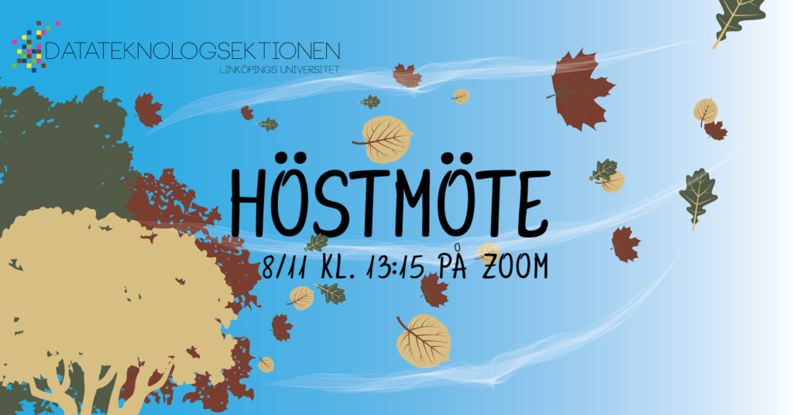

Medlemmar i sektionen kallas till ordinarie höstmöte den 8 november 2020. Detta är ett av sektionens tre ordinarie sektionsmöten. Sektionsmöten är sektionens högst beslutande organ där du som medlem har möjligheten att vara med och besluta om sektionens verksamhet.

**Datum:** 8 november 2020  
**Tid:** 13:15

<!--more Läs mer-->

På grund av regeringens beslut om att förbjuda allmänna sammankomster med fler än 50 deltagare kommer deltagandet på höstmötet att ske över Zoom. Mer information om hur du ansluter kommer framöver på [www.d-sektionen.se/hostmote](http://www.d-sektionen.se/hostmote).

Den preliminära föredragingslistan samt mer information om mötet finns tillgängligt på [www.d-sektionen.se/hostmote](http://www.d-sektionen.se/hostmote).

## Från sektionens stadgar:

**§5.13 Höstmötet**Det åligger sektionsmötet att på höstmötet:

- Välja fadderigeneral för kommande mottagningsperiod
- Välja fadderikassör för kommande mottagningsperiod
- Behandla verksamhetsberättelse, ekonomisk berättelse och årsrevisionsberättelse för föregående års sektionsstyrelse
- Besluta om ansvarsfrihet för föregående års sektionsstyrelse
- Behandla verksamhetsberättelse, ekonomisk berättelse och årsrevisionsberättelse för föregående års fadderi
- Besluta om ansvarsfrihet för föregående års fadderi
- Behandla verksamhetsberättelse, ekonomisk berättelse och årsrevisionsberättelse för föregående års festeri
- Besluta om ansvarsfrihet för föregående års festeri
- Behandla verksamhetsberättelse, ekonomisk berättelse och årsrevisionsberättelse för föregående års damförening
- Besluta om ansvarsfrihet för föregående års damförening
- Behandla verksamhetsberättelse, ekonomisk berättelse och årsrevisionsberättelse för föregående års aktivitetsutskott
- Besluta om ansvarsfrihet för föregående års aktivitetsutskott
- Behandla verksamhetsberättelse, ekonomisk berättelse och årsrevisionsberättelse för föregående års Arbetsmarknadsgruppen
- Besluta om ansvarsfrihet för föregående års Arbetsmarknadsgruppen
