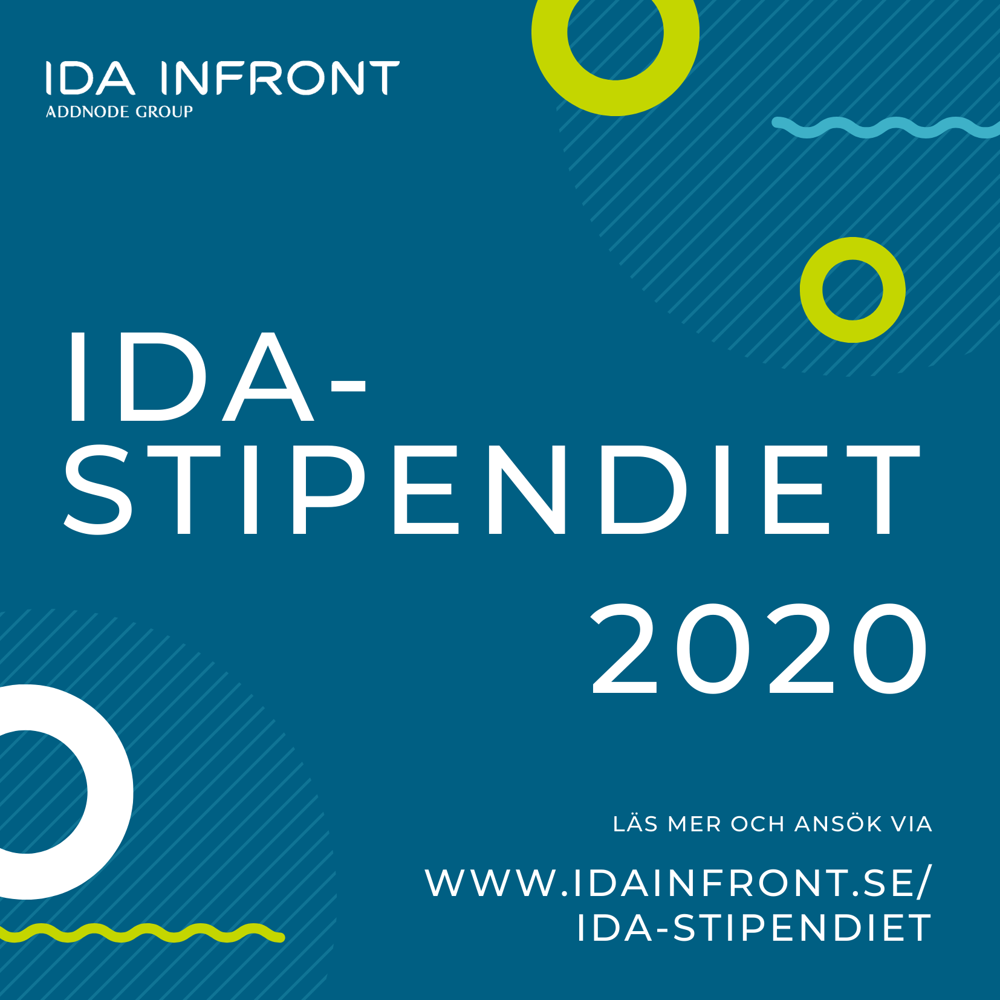

Ida Infront bygger framtidens informationssamhälle. Att vara tankeledare inom det de gör och att alltid sträva efter att leverera lösningar som effektiviserar samt förenklar samhället har sedan start varit deras mission.

För att stimulera och uppmuntra de studenter som delar entusiasmen om effektiva digitala lösningar och som önskar få hjälp att realisera sin idé, har Ida Infront valt att instifta Ida-stipendiet.

Varmt välkommen att läsa mer och ansöka [här](https://www.idainfront.se/ida-stipendiet/)!
