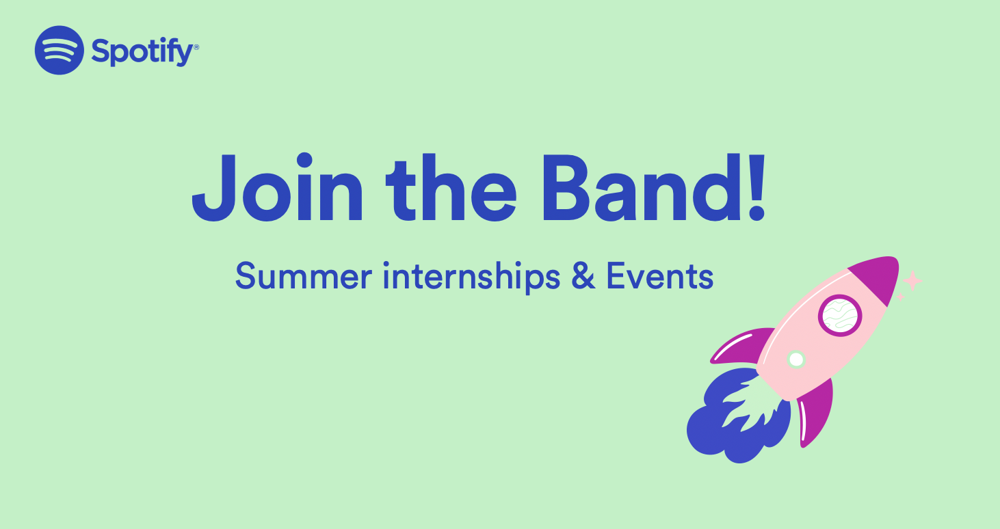

Got questions about our upcoming [Summer Internships](http://spotifyjobs.com/students/) at Spotifyjobs.com/students? Look no further! We’re hosting two separate events tailored for your interests.  
  
You’ll get to meet managers as well as former interns who’ll give you a better idea about how our internships are like in each respective field. It’s really easy! If you’re into software engineering, join us on **Nov 3rd**. If Machine Learning, Data, Product or Research is more your thing, we can’t wait to meet you on **Nov 4th**.   
  
Check out the events below and secure your spot!   
  
[https://spotifystudenteventhub.splashthat.com/](https://spotifystudenteventhub.splashthat.com/)  
  
We’re looking forward to seeing you!  
  
Last day to apply for our summer internships is **November 22nd**!

All the best,  
Spotify Campus Team
