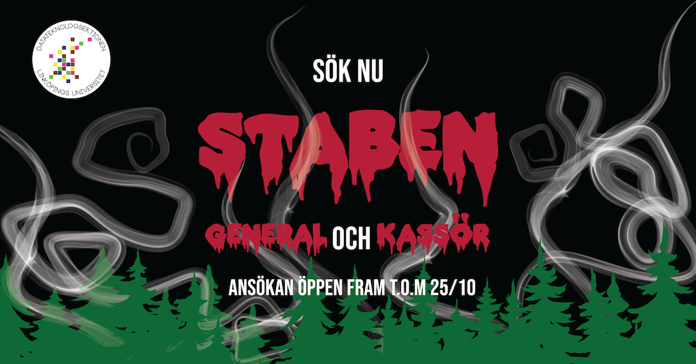

Tiden är kommen! Äntligen har ansökan till General och Kassör för STABEN 21/22 öppnat!!

Vi i Valberedningen söker just nu en General och en Kassör till nästa läsårs STABEN.Så är du taggad på att leda en grupp STABAR genom deras livs äventyr? Eller kanske se tills så att ekonomin går runt under tiden? Är du taggad på att ge Nollan ett oförglömligt Nolle-P? - Då ska du ta chansen att söka nu!

<!--more-->

* * *

### Postbeskrivningar:

**STABEN General:**  
Som Fadderigeneral har du den övergripliga kollen på STABEN och ser till att Nolle-p genomförs på ett bra och smidigt sätt. Tillsammans med fadderiets kassör rekryteras nästa årets STABEN och börjar sedan att jobba fram ett tema för STABEN. Som Fadderigeneral ser du till att gruppdynamiken är bra, och du gör ditt bästa för att övriga medlemmar sköter sina poster och stöttar dem i deras arbete. Det är Generalen som bär huvudansvaret för att planera arbetet som ska göras vilket innefattar att sätta deadlines m.m, och det är också Generalen som bär ansvaret för att dessa planer fullföljs. Som General för fadderiet deltar du även på möten med General-gruppen, LinTek och andra utskott för att strukturera upp Nolle-p och agerar i dessa sammanhang STABEN:s ansikte utåt och uppåt, samt för fadderiets talan.

**STABEN Kassör:**  
Det första som görs efter att ha blivit invald som kassör för fadderiet, är att sätta upp mål tillsammans med generalen och bestämmelser kring poster och upplägg för rekryteringen. Därefter börjar arbetet tillsammans med nya STABEN för att planera vad som ska ske under mottagningen. Under våren sätts budget tillsammans med föregående kassör.

Kassörsrollen innebär budgetering, bokföring, att hålla koll på kvitton och fakturor samt att ta beslut för frågor kring inköp eller förändringar. Utöver detta innebär kassörsrollen även att man är generalens högra hand och det är därför bra att man som kassör är villig att gripa in där det behövs. Som med alla andra poster i STABEN är det även viktigt att man är prestigelös och villig att lägga ner tid på arbete som är utanför postens ramar.

* * *

Känner du att någon av posterna lockar dig? Då hittar du ansökningsformulär här: [https://forms.gle/dTpcNcbk4uayczKu5](https://forms.gle/dTpcNcbk4uayczKu5)

Känner du att detta kanske inte alls är något för dig men vet någon annan som hade passat perfekt till någon av posterna. Då går det bra att nominera den personen i länken nedan:  
[https://forms.gle/Vi2isdK82pRRJkoD8](https://forms.gle/Vi2isdK82pRRJkoD8?fbclid=IwAR3BigrDDlVL56UhQtk6GJiUbiD0HNtvBc72h6XI4NW_m07GvNq_C0ZN2M0)

Har du några frågor så var inte rädd för att maila oss på [val@d-sektionen.se](mailto:val@d-sektionen.se) eller skriva till nuvarande General, [general@staben.info](mailto:kassor@staben.info) eller Kassör, [kassor@staben.info](mailto:kassor@staben.info) för mer postspecifika frågor.

Ansökan är öppen fram till kl 23:59 den 25 oktober och intervjuer kommer ske löpande.
