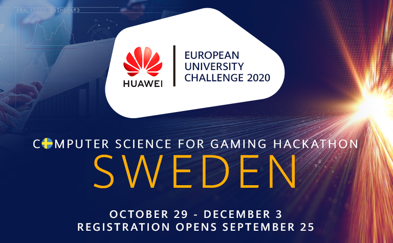

Huawei, the leading global provider of information and communications technology (ICT) infrastructure and smart devices, is thrilled to host this year’s European University Challenge 2020 in Sweden. This four-week event  
is 100% virtual and open to students who are working towards their Master’s or PhD in Computer Science, Data Science, Robotics, Mathematics, IT, Programming, or related field.

In this exciting challenge, participants will utilize AI and programming to win matches in a head to head gaming competition, all in an effort to win great prizes and be eligible for possible internship opportunities.

The last day to sign up is 22nd november, so hurry up and secure your spot. Read more and sign up [here](https://huawei-euchallenge.bemyapp.com/sweden)

The Award Ceremony will take place 3rd of december 16:00. You can watch it [here](https://www.youtube.com/embed/BNDdNnz94Q8)
