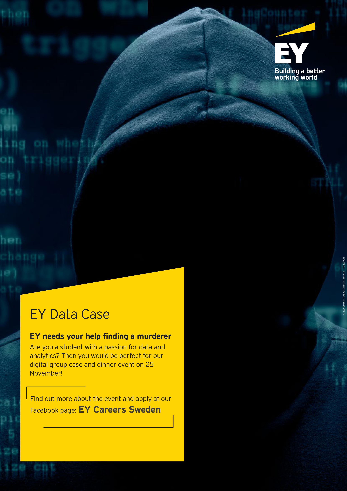

Are you a student with an interest for data and analytics? Then we want you to represent your school in our EY Data Case. Can you analyze the data clues, solve the mystery and find the murderer?

EY Data Case is a digital event and will take place on the 25th of November. During the evening you will be divided into teams and solve a mystery case by analyzing several datasets. Our experts working within the data and analytics area will be there to guide and support you.

After the murderer is found we will order food with vouchers provided by EY and you will get the chance to digitally mingle and eat dinner with EY-employees.

Attend the event on [Facebook](https://www.facebook.com/events/728964517698976) and Sign-up at [EY Careers](https://eygbl.referrals.selectminds.com/student-opportunities/jobs/ey-data-case-146311) before 2020-11-18.

Best regards,

EY Data & Analytics Team
