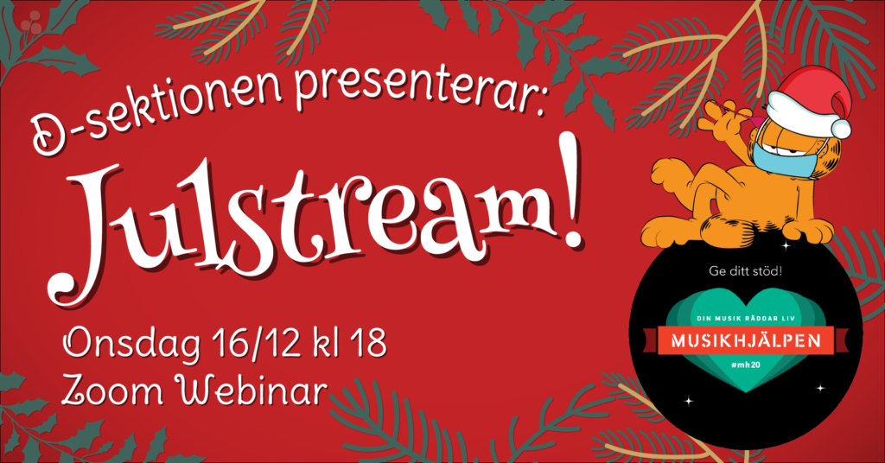

D-sektionens styrelse tillsammans med D-Band anordnar ett julmys för att bidra till musikhjälpen samtidigt som vi har det lite mysigt ihop på sektionen!

Kvällen kommer bjuda på allt från musikquiz som D-Band står för till lite allmänt julmys, kahoots och julhälsningar! Det är Carl Magnus och Aleksi som kommer att hålla låda för er hela kvällen, så det är bara för er att ta fram julmusten, pepparkakorna och skumtomtarna och sätta er framför streamen!

<!--more-->

Streamen kommer att ske över Zoom, och mer information hur du anmäler dig kommer!

Vi kommer även att samla in till musikhjälpen under kvällen. Du kommer att via musikhjälpen kunna skicka in en hälsning tillsammans med din gåva som vi kommer läsa upp i streamen! Det går dessutom att redan nu skicka in bidrag.

I år handlar musikhjälpen om rätten till vård. Minst halva världens befolkning tillgång till grundläggande hälso- och sjukvård. Bland de 7,4 miljoner barn och unga som dog under 2019 hade de allra flesta fall varit möjliga att förebygga eller behandla. Det finns kunskap och resurser för att rädda miljontals liv, som inte når fram.

Skänk din gåva här:  
[https://bossan.musikhjalpen.se/datateknologssektionen-foer-musikhaelpen](https://bossan.musikhjalpen.se/datateknologssektionen-foer-musikhaelpen)

Ingen människa ska lämnas utan vård - Din musik räddar liv. #MH20

**Läs mer på eventet: [https://fb.me/e/gtibKDDOR](https://fb.me/e/gtibKDDOR)**
