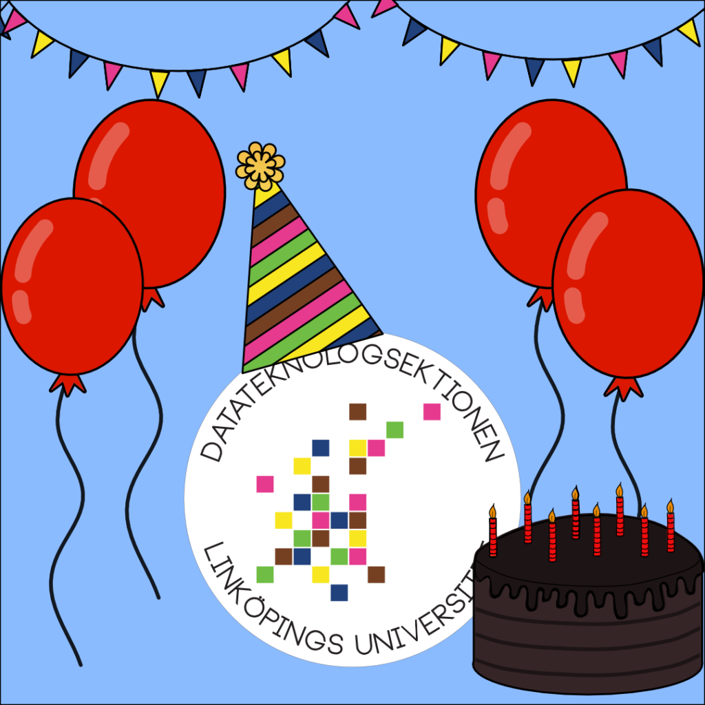

Idag fyller Datateknologsektionen hela 45 år! 

Festkommittén har, dagen till ära, tyvärr inte så mycket att komma med. Vi vill dock lugna era nu chockade sinnen, ett firande av sektionens 45-årsjubileum kommer bli av senare under vårterminen. Om du som sektionsmedlem vill fira sektionens födelsedag och är besviken på avsaknaden av officiellt födelsedagskalas just idag har festkommittén några förslag på hur du kan göra idag lite festligare:

- Umgås online med andra sektionsmedlemmar (det finns ju en Discordserver för detta som skulle vara perfekt).
- Stäm upp i sång (välj något kul från en sångbok).
- Plugga (finns det något bättre sätt att hedra sektionen på?).
- Vad du vill egentligen, ta dagen till ära och gör något roligt!

När dagen är över går det att vara lugn i vetskapen att sektionens grundande år 1976 kommer att firas under flera dagar längre in på terminen. På grund av rådande situation kan festkommittén i nuläget inte meddela ifall firandet kommer att ske på plats. Vi vill uppmana sektionsmedlemmar att hålla koll på sektionens informationskanaler, då mer information kommer att dyka upp där. 

// Festkommittén
