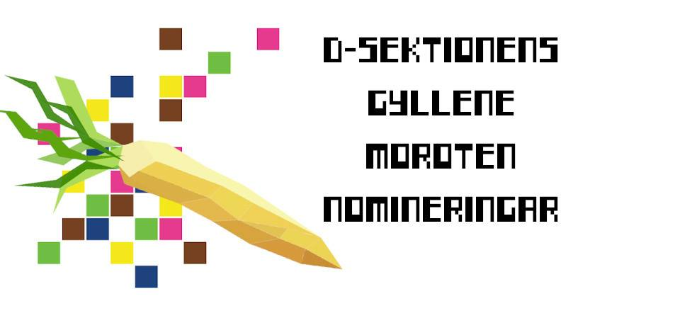

Halloj sektionen!

Har du haft en examinator/handledare/labbassistent/etc som du anser visat mycket engagemang för ämnet eller varit mycket pedagogisk i undervisningen? Kanske särskilt nu under distansläget, där många kurser snabbt blev annorlunda?

Tveka då inte att nominera denne till Gyllene Moroten! Detta är LinTeks pedagogiska pris som delas ut varje år till en anställd på LiU för att visa uppskattning för personens pedagogiska meriter och engagemang.

D-sektionen kommer även att utse en vinnare utifrån dessa nomineringar som vinner ett pris från vår sektion för att visa lite extra uppskattning. Detta pris kommer att delas ut under sektionens vårmöte.

Nomineringsformuläret samt mer information om priset finner du [här](https://forms.gle/xcEJdBrPU5kJDw3R6):

Sista dagen för nominering är 14/2, så missa inte att nominera om du tycker att någon särskild LiU-anställd förtjänar priset!

Skulle du ha någon övrig fråga om Gyllene Moroten så kan du skicka den till utbu@d-sektionen.se.
